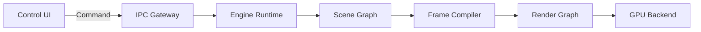

# 000 — Documentation Contract

**Status:** Proposed  
**Audience:** Maintainers, contributors, coding agents  
**Canonical:** Yes

---

## 1. Purpose

This document defines how Mirae specifications are interpreted and how they control implementation.

The documentation is a design contract. It is not an informal description of current behavior. Its purpose is to constrain implementation sufficiently that multiple contributors or coding agents can build compatible parts of the system without independently inventing architecture.

---

## 2. Normative Language

The following words are normative:

- **MUST** and **MUST NOT** define mandatory behavior.
- **SHOULD** and **SHOULD NOT** define preferred behavior that may be overridden only by a documented reason.
- **MAY** defines optional behavior.
- **INVARIANT** identifies a condition that must hold for the specified lifecycle.
- **CANONICAL** identifies a source of truth.
- **EXPERIMENTAL** identifies behavior that may change without compatibility guarantees.

Requirements written without normative keywords are explanatory unless they define a named invariant, interface, or acceptance criterion.

---

## 3. Document Header

Every implementation-facing document MUST include:

```text
Status
Audience
Canonical
Owners
Last reviewed
Related ADRs
Required context
```

The initial generated pack omits owner names until project maintainers are assigned. Future edits SHOULD add them.

---

## 4. Required Structure

Subsystem specifications SHOULD use the following structure:

1. Purpose
2. Scope
3. Goals
4. Non-goals
5. Responsibilities
6. Non-responsibilities
7. Invariants
8. Architecture
9. Components
10. Data model
11. Interfaces
12. Data flow
13. State flow
14. Lifecycle
15. Ownership and memory
16. Concurrency
17. Error behavior
18. Performance constraints
19. Security and privacy
20. Platform notes
21. Required tests
22. Acceptance criteria
23. Open questions
24. AI implementation notes
25. Related documents
26. Related ADRs

Sections MAY be omitted when not applicable, but omission must not hide a design decision required for implementation.

---

## 5. Canonical Behavior

### 5.1 Documentation before implementation

A new cross-cutting subsystem MUST have an accepted or proposed specification before implementation begins.

A small local implementation detail MAY be designed in code when all of the following are true:

- it does not change a public or internal contract;
- it does not cross a subsystem boundary;
- it does not change persistence;
- it does not affect concurrency ownership;
- it does not affect process isolation;
- it does not create a permanent dependency;
- it is covered by tests.

### 5.2 Code divergence

When code diverges from an Accepted specification:

1. the divergence must be reported;
2. the implementation must not silently redefine the architecture;
3. either the code is corrected or the specification is changed through review;
4. if the divergence is architectural, an ADR is required.

### 5.3 Tests are not the specification

Tests verify behavior but do not define intended architecture by themselves. A test may encode a bug, temporary workaround, or outdated behavior.

---

## 6. Ambiguity Policy

An implementer MUST NOT invent externally observable behavior when the specification is ambiguous.

When ambiguity is discovered:

- choose the smallest reversible internal detail that preserves all invariants;
- record the assumption in the implementation plan or PR;
- create a documentation task;
- avoid exposing the assumption as stable API behavior.

For high-impact ambiguity, implementation must stop until the specification or ADR resolves it.

High-impact ambiguity includes:

- ownership across threads or processes;
- project format semantics;
- failure recovery;
- synchronization;
- resource lifetime;
- permissions;
- plugin capabilities;
- network retry behavior;
- public API shape.

---

## 7. Documentation Granularity

Each file should have one primary responsibility.

Good examples:

- scene graph;
- render graph;
- audio routing;
- master clock;
- project migrations;
- crash recovery.

Bad examples:

- “engine internals” containing unrelated runtime, rendering, audio, and persistence rules;
- a single “platform” document that hides Windows, macOS, and Linux differences;
- an SDK document that mixes permissions, lifecycle, UI injection, and publishing.

Cross-cutting behavior belongs in a dedicated document and is referenced rather than duplicated.

---

## 8. Diagrams

Mermaid is the default diagram format.

Diagrams MUST:

- name components consistently with the terminology document;
- use direction to communicate control or data flow;
- distinguish process boundaries;
- distinguish asynchronous queues from direct calls;
- avoid decorative complexity;
- be accompanied by prose describing invariants and failure behavior.

Example:



A diagram is explanatory. It does not replace interface and ownership definitions.

---

## 9. Stable Naming

Once a term is canonical, documents and code SHOULD use it consistently.

Aliases MAY be listed in the terminology document, but public code should not use competing names for the same concept.

Renaming a foundational term requires:

- terminology update;
- all affected specifications;
- schemas and public APIs;
- migration notes if persisted;
- an ADR when the rename changes meaning or boundaries.

---

## 10. Versioning

Specifications do not use semantic version numbers individually.

Compatibility-sensitive contracts use their own versions:

- project schema version;
- IPC protocol version;
- SDK API version;
- extension manifest version;
- diagnostic event schema version.

Documentation changes must state which contract version is affected.

---

## 11. Review Standard

A specification review should ask:

- Is the responsibility located in the right subsystem?
- Are ownership and lifetime explicit?
- Are process and thread boundaries explicit?
- Can the behavior be tested?
- Are non-goals strong enough to prevent scope drift?
- Are failure modes bounded?
- Are performance claims measurable?
- Are platform differences hidden behind valid abstractions?
- Does the design preserve local-first operation?
- Can an AI implement this without guessing core architecture?

---

## 12. AI Implementation Notes

This document is canonical.

A coding agent MUST:

- read required context before editing code;
- preserve all named invariants;
- avoid adding undocumented public behavior;
- prefer small, reversible internal choices;
- report unresolved conflicts;
- update tests with implementation;
- update documentation when a contract changes.

Priority order:

1. Correctness
2. Determinism
3. Reliability
4. Security
5. Performance
6. Maintainability
7. Convenience
