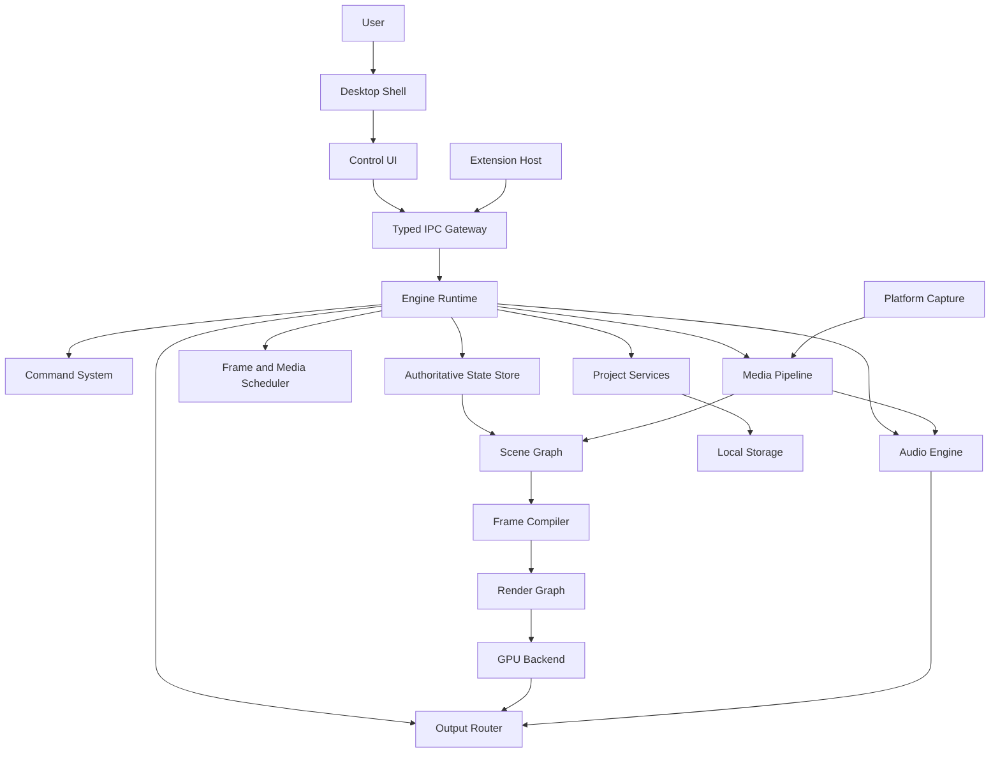

# 001 — Project Overview

**Status:** Proposed  
**Audience:** All contributors and coding agents  
**Canonical:** Yes  
**Required context:** `000-documentation-contract.md`

---

## 1. Purpose

Mirae is a native desktop application for live video production, recording, replay, and streaming.

The product combines:

- a native Rust engine;
- a GPU-first compositor;
- native platform capture;
- real-time audio processing;
- recording and streaming outputs;
- a local project model;
- a modern control interface;
- an extension system with explicit permissions.

Mirae is not intended to reproduce OBS Studio screen for screen. It aims to provide a more predictable and coherent live-production system while preserving the power expected by advanced users.

---

## 2. Primary Product Capabilities

Mirae MUST support the following capability families:

### 2.1 Project management

- create, open, save, duplicate, archive, and recover projects;
- maintain a local project library;
- autosave without blocking live output;
- migrate older project schemas safely;
- recover from interrupted writes and process crashes.

### 2.2 Scenes and sources

- define scenes as structured compositions;
- add, remove, reorder, group, transform, and configure sources;
- support reusable source definitions and per-scene instances where appropriate;
- provide preview and program states;
- support transitions without mutating the canonical scene definition destructively.

### 2.3 Capture and media

- capture displays, windows, cameras, audio devices, and supported platform surfaces;
- decode local media;
- generate text and graphics;
- ingest network sources through explicitly supported protocols;
- expose health and diagnostics for capture sources.

### 2.4 Rendering

- compile the scene state into a render workload;
- keep the steady-state video path on the GPU when supported;
- composite sources, masks, effects, color transforms, and overlays;
- render preview, program, recording, replay, and output surfaces;
- avoid unnecessary GPU-to-CPU round trips.

### 2.5 Audio

- capture and decode audio;
- convert streams into an internal canonical format;
- mix and route channels;
- apply meters, gain, mute, monitoring, and effects;
- maintain synchronization with the master media timeline;
- isolate real-time audio work from blocking operations.

### 2.6 Outputs

- stream to configured services and custom endpoints;
- record locally;
- maintain a replay buffer;
- expose output health, dropped-frame reasons, encoder load, network state, and recovery state;
- allow outputs to fail independently when possible.

### 2.7 Extensions

- add sources, effects, outputs, commands, and controlled UI surfaces;
- isolate extension failures from the engine;
- require explicit capabilities;
- version extension APIs;
- prevent untrusted extension code from running inside critical real-time threads.

---

## 3. Product Properties

Mirae is defined by the following properties.

### 3.1 Native

The engine, process model, rendering, capture, audio, persistence, and critical platform integration are native.

A web technology MAY be used for the control UI, but the UI MUST NOT become the media engine.

### 3.2 GPU-first

Video composition and effects prefer GPU-resident resources.

GPU-first does not mean “all work must execute on the GPU.” Control logic, project state, scheduling, persistence, and many media operations remain CPU responsibilities.

### 3.3 Local-first

Projects, assets, credentials, configuration, and core operation are local by default.

A user MUST be able to create, edit, record, and produce locally without a Mirae account or mandatory cloud service.

### 3.4 Offline-capable

Core production operation MUST continue without internet connectivity, except for capabilities whose purpose inherently requires a network, such as live streaming or remote media ingestion.

### 3.5 Predictable

Mirae SHOULD expose clear state and avoid hidden automation that changes production behavior unexpectedly.

### 3.6 Recoverable

A failure in one output, source, extension, or auxiliary process SHOULD NOT corrupt the project or force unrelated outputs to stop.

---

## 4. Intended Users

The architecture must support:

- individual streamers;
- content creators;
- small production teams;
- event operators;
- esports and community productions;
- technical users who require precise control;
- users who want a simpler interface without losing professional behavior.

The initial product is not designed for distributed broadcast facilities requiring frame-accurate SDI routing across many machines. The architecture should avoid making that future impossible, but it is not an initial requirement.

---

## 5. Deployment Model

Mirae is a desktop application composed of multiple cooperating processes.

A typical installation includes:

- desktop shell;
- control UI;
- engine runtime;
- optional isolated media or device workers;
- extension host;
- updater;
- crash handler.

The exact number of processes may vary by platform and release stage. Process boundaries are chosen for fault isolation, privilege control, and lifecycle management rather than for novelty.

---

## 6. Technology Direction

The current canonical direction is:

| Area | Direction |
|---|---|
| Core language | Rust |
| Rendering abstraction | `wgpu` |
| Window and event integration | native shell with `winit` where appropriate |
| Control UI | React + TypeScript |
| Webview bridge | native embedded webview through a minimal shell layer |
| Media toolkit | FFmpeg used as a toolkit behind Mirae-owned abstractions |
| Persistence | explicit project schema, atomic writes, migrations |
| IPC | versioned typed protocol |
| Extensions | isolated host with capabilities and permissions |

An ADR is required to replace a foundational technology choice.

---

## 7. High-Level Architecture

---

## 8. Architectural Invariants

1. The UI MUST NOT be the authoritative owner of engine state.
2. The engine MUST remain operable when the UI temporarily disconnects.
3. Project persistence MUST NOT serialize ephemeral GPU, thread, or process handles.
4. Render scheduling MUST NOT depend on React render timing.
5. Real-time audio work MUST NOT perform blocking file, network, or IPC operations.
6. A project write MUST be atomic from the user's perspective.
7. Extensions MUST NOT execute inside critical render or audio callbacks.
8. Cross-process messages MUST use a versioned typed contract.
9. Platform-specific implementation MUST be hidden behind stable domain interfaces.
10. Output failure MUST be isolated when the failed output does not invalidate the whole production graph.

---

## 9. Success Criteria

The architecture succeeds when:

- a contributor can locate the owner of a behavior quickly;
- the application can recover projects after process interruption;
- output failures are diagnosable;
- GPU and CPU work are measurable;
- UI changes do not destabilize the media engine;
- platform-specific work does not leak throughout domain code;
- coding agents can implement scoped features from canonical specifications;
- new features extend the system without bypassing existing contracts.

---

## 10. Non-Goals

This document does not define:

- exact UI layout;
- final branding;
- pricing;
- cloud account features;
- marketplace behavior;
- every future protocol;
- implementation details of each subsystem.

Those are specified elsewhere or intentionally deferred.

---

## 11. AI Implementation Notes

The implementation MUST preserve the architectural invariants above.

Do not collapse the engine into the UI process to simplify early development. A temporary prototype MAY use fewer processes only when boundaries remain represented as interfaces and the prototype is clearly marked.

Do not expose FFmpeg structures, `wgpu` objects, operating-system handles, or webview-specific types across domain boundaries.

When choosing between rapid coupling and a small explicit abstraction, prefer the explicit abstraction if the dependency crosses a subsystem boundary.
