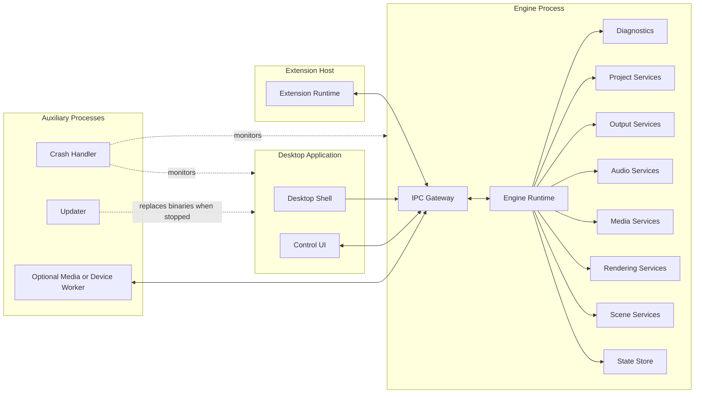
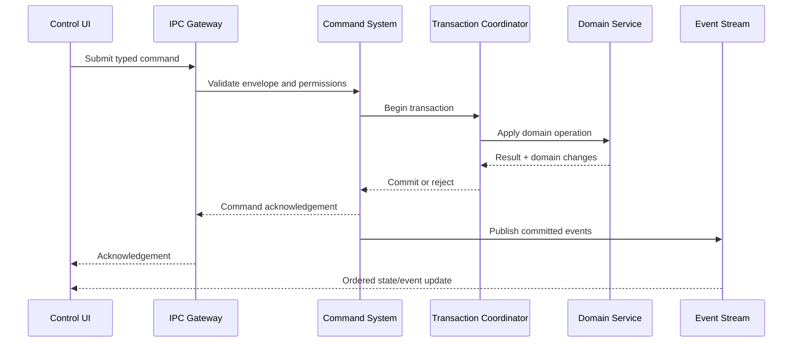
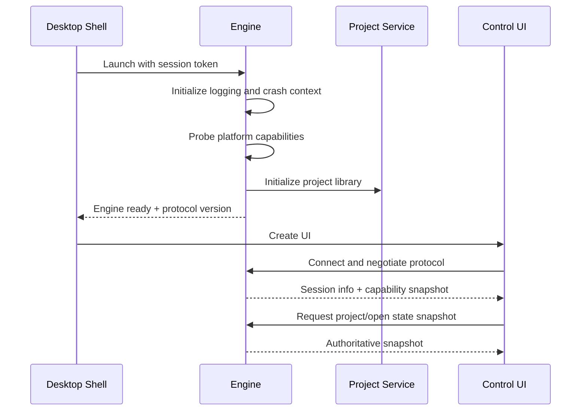

# 004 — System Overview

**Status:** Proposed  
**Audience:** Architecture, runtime, rendering, media, platform, UI contributors  
**Canonical:** Yes  
**Required context:** `001-project-overview.md`, `003-design-principles.md`

---

## 1. Purpose

This document defines the top-level system decomposition and communication paths.

It does not define detailed APIs. Those belong to subsystem specifications.

---

## 2. Top-Level Components

Mirae is divided into the following top-level components:

1. Desktop shell
2. Control UI
3. Engine runtime
4. Domain and state services
5. Scene and composition services
6. Rendering services
7. Media and capture services
8. Audio services
9. Output services
10. Project and persistence services
11. Platform adapters
12. Extension host
13. Updater and crash handler
14. Diagnostics and observability

---

## 3. Process Topology

The target process topology is:

Initial releases MAY combine some engine services in one process. The logical ownership described here remains canonical.

---

## 4. Desktop Shell

### Responsibilities

- create application windows;
- host the control UI;
- integrate native menus, tray, file open, protocol links, and shutdown;
- launch and supervise the engine process;
- display startup and fatal recovery states;
- coordinate safe application restart.

### Non-responsibilities

- project mutation;
- media capture;
- rendering;
- output control logic;
- encoding;
- extension execution.

---

## 5. Control UI

The UI is a projection and command surface.

### Responsibilities

- display authoritative engine state;
- collect input;
- build typed commands;
- maintain view-local state;
- show pending, accepted, rejected, and failed operations;
- display diagnostics;
- support accessibility;
- provide optimistic interaction only when rollback is defined.

### Synchronization model

The UI receives:

- state snapshots;
- ordered state patches;
- runtime events;
- diagnostic events;
- command acknowledgements.

The UI must track an engine session identifier and state generation. A reconnect may require a fresh snapshot.

---

## 6. Engine Runtime

The engine runtime is the orchestration authority.

### Responsibilities

- lifecycle;
- service registry;
- command routing;
- transaction boundaries;
- authoritative state;
- scheduling;
- subsystem coordination;
- output startup and shutdown;
- recovery;
- diagnostics.

The engine runtime must not become a “god object.” It coordinates services through explicit interfaces.

---

## 7. Command and Event Flow

A command acknowledgement and an event are not interchangeable.

- acknowledgement answers whether the command was accepted;
- events describe committed changes or runtime observations.

---

## 8. Scene and Composition

The scene system stores semantic composition state.

It contains:

- scene definitions;
- source instances;
- transforms;
- hierarchy;
- visibility;
- behaviors;
- transition references;
- semantic effect configuration.

It does not store concrete GPU command buffers or platform capture handles.

The frame compiler converts semantic scene state and live source availability into a render graph for a specific frame or surface.

---

## 9. Rendering

The rendering system owns:

- GPU device abstraction;
- resource creation;
- render graph compilation;
- pipeline cache;
- shader modules;
- texture pools;
- color processing;
- compositor passes;
- preview and output surfaces;
- GPU timing and recovery.

Rendering receives immutable frame input or generation-stable references. It must not mutate project domain state directly.

---

## 10. Media and Capture

The media subsystem owns:

- source acquisition;
- decode;
- format negotiation;
- timestamp normalization;
- frame queues;
- source health;
- media playback state;
- network ingest adapters.

Capture backends are platform implementations behind common source contracts.

---

## 11. Audio

The audio system owns:

- audio input;
- decode;
- canonical sample conversion;
- mixing;
- routing;
- monitoring;
- metering;
- effect processing;
- synchronization;
- output audio delivery.

The real-time audio path must remain isolated from blocking engine work.

---

## 12. Outputs

The output router owns independent output pipelines.

An output pipeline may include:

- source selection;
- video scaling;
- pixel format conversion;
- audio mapping;
- encoder;
- muxer;
- network transport or file sink;
- retry and recovery policy;
- health reporting.

Outputs share upstream resources when safe, but output failure remains isolated.

---

## 13. Projects and Persistence

Project services own:

- project schema;
- open and validation;
- save transactions;
- autosave;
- recovery;
- asset references;
- library metadata;
- migrations.

Project persistence receives domain snapshots. It does not serialize live subsystem objects.

---

## 14. Platform Adapters

Platform adapters implement:

- display and window capture;
- audio device access;
- camera integration;
- hardware encoders;
- graphics interop;
- permissions;
- secure credentials;
- system notifications;
- code signing and update integration.

Platform-specific behavior is reported through common capability and diagnostic models.

---

## 15. Extension Host

The extension host executes extension logic outside critical engine processes.

It communicates through:

- versioned API calls;
- subscribed events;
- capability-scoped storage;
- declared network or filesystem access;
- bounded resource policies.

An extension cannot receive direct access to renderer internals, raw engine memory, or unrestricted credentials.

---

## 16. Startup Sequence

Output startup occurs only after the relevant project and device state is restored and validated.

---

## 17. Shutdown Sequence

Shutdown must be staged:

1. reject new non-shutdown commands;
2. request output drain or bounded stop;
3. stop capture and media sources;
4. flush project changes and autosave;
5. stop extension host;
6. release GPU and platform resources;
7. close IPC;
8. exit engine;
9. close UI and shell.

A forced shutdown path must exist for hung workers, but project safety has priority within a bounded timeout.

---

## 18. Global Invariants

1. The engine owns authoritative production state.
2. Project state and runtime state remain distinguishable.
3. All queues are bounded.
4. Cross-process contracts are versioned.
5. Critical callbacks do not block on IPC, disk, or network.
6. Platform APIs do not leak into domain models.
7. Extensions are isolated.
8. Save operations are atomic.
9. Output health is observable.
10. UI reconnect does not require terminating active outputs.

---

## 19. AI Implementation Notes

Build top-level interfaces before deeply coupling implementations.

Do not place all services in one crate merely because they initially share one process.

Use explicit adapters for renderer, media toolkit, platform capture, storage, and IPC.

Every cross-thread or cross-process queue must document capacity and overflow policy.

Do not let UI convenience create a second source of truth.
