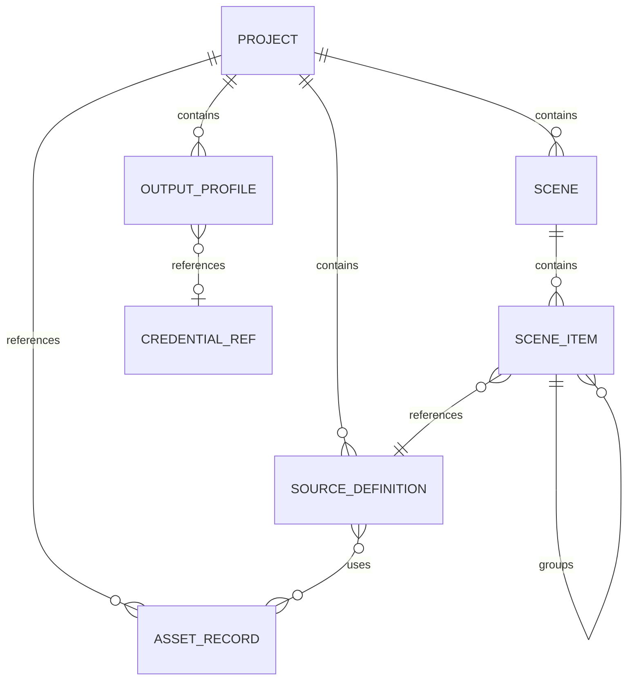

# 005 — Domain Model

**Status:** Proposed  
**Audience:** Domain, runtime, project, UI, SDK contributors  
**Canonical:** Yes  
**Required context:** `002-product-and-system-boundaries.md`, `004-system-overview.md`

---

## 1. Purpose

This document defines the foundational domain entities and their relationships.

The domain model is independent of:

- React;
- IPC transport;
- FFmpeg;
- `wgpu`;
- operating-system APIs;
- database libraries;
- extension runtime implementation.

---

## 2. Identity

Persistent domain entities use stable opaque identifiers.

Recommended representation:

```rust
pub struct EntityId(Uuid);
```

Concrete type names SHOULD use newtypes:

```rust
pub struct ProjectId(EntityId);
pub struct SceneId(EntityId);
pub struct SourceId(EntityId);
pub struct SceneItemId(EntityId);
pub struct OutputId(EntityId);
```

Requirements:

- IDs MUST remain stable across saves.
- IDs MUST NOT encode array position.
- IDs MUST NOT expose process or memory location.
- Runtime-only instances MAY use separate generation-scoped identifiers.

---

## 3. Core Entities

### 3.1 Project

A `Project` is the root persisted production configuration.

It contains references to:

- project metadata;
- scene collection;
- source definitions;
- output profiles;
- audio configuration;
- replay configuration;
- asset registry;
- user-defined commands or automation configuration;
- extension configuration;
- schema version.

A project does not contain active devices, sockets, GPU resources, or credentials.

### 3.2 Scene

A `Scene` is a semantic composition.

It contains:

- stable identity;
- name;
- root scene item ordering;
- optional canvas defaults;
- transition defaults;
- scene-level behavior configuration;
- metadata.

A scene is not a rendered image.

### 3.3 Source Definition

A `SourceDefinition` describes a reusable media, capture, generated, or nested-scene source.

Examples:

- display capture;
- window capture;
- camera;
- microphone;
- media file;
- image;
- text;
- browser source;
- color;
- nested scene;
- network source.

It contains persisted configuration and references to secrets by credential identifier.

A source definition does not contain a live decoder or capture object.

### 3.4 Scene Item

A `SceneItem` places a source or group inside a scene.

It contains:

- source reference or group contents;
- transform;
- crop;
- visibility;
- blend mode;
- masks;
- effect chain references;
- lock state;
- z-order defined by scene ordering;
- optional per-instance overrides.

Multiple scene items may reference the same source definition where semantics allow.

### 3.5 Group

A `Group` is a scene item containing ordered child scene items.

Group transforms apply to children through composed transforms.

The architecture must define and test:

- transform multiplication order;
- clipping behavior;
- visibility propagation;
- effect application order;
- cycle prevention.

### 3.6 Transition

A `Transition` defines how program output moves between scene states.

It contains:

- type;
- duration;
- parameters;
- optional shader or asset references;
- audio transition policy.

A transition execution is runtime state, not persisted as an active object.

### 3.7 Output Profile

An `OutputProfile` describes a recording, stream, replay, or virtual-output configuration.

It contains:

- output kind;
- video configuration;
- audio configuration;
- encoder preferences;
- destination reference;
- retry policy;
- file naming policy where applicable.

Credentials are indirect references.

### 3.8 Asset

An `AssetRecord` identifies a managed or external file used by the project.

It contains:

- asset ID;
- source URI or managed path;
- content type;
- optional content hash;
- availability state;
- portability policy;
- import metadata.

### 3.9 Credential Reference

A `CredentialRef` is a non-secret identifier resolving through the platform credential store.

It may contain:

- credential ID;
- provider kind;
- display label;
- account metadata that is safe to persist.

It never contains tokens or passwords.

---

## 4. Runtime Entities

Runtime entities are not persisted directly.

### 4.1 Source Runtime

A source runtime represents an active source instance.

It owns or references:

- capture session;
- decoder;
- frame queue;
- audio stream;
- source health;
- reconnect state;
- platform handles behind adapters.

A source runtime is associated with a source definition and an engine session generation.

### 4.2 Render Instance

A render instance represents compiled render state for a surface and generation.

It may include:

- resolved node graph;
- GPU resources;
- pipelines;
- descriptor bindings;
- frame-local constants;
- resource barriers.

### 4.3 Output Runtime

An output runtime owns:

- encoder sessions;
- muxer;
- transport or file sink;
- retry state;
- output metrics;
- lifecycle state.

### 4.4 Transition Runtime

A transition runtime includes:

- source scene snapshot;
- destination scene snapshot;
- start time;
- duration;
- progress;
- resolved transition resources.

---

## 5. State Categories

Mirae distinguishes four categories.

### 5.1 Persisted domain state

Saved in the project.

### 5.2 Session state

Exists for the active engine session but is not saved as project intent.

Examples:

- current preview scene;
- current program scene;
- selected scene item;
- active output state;
- temporary live transform drag.

Some session state may be restored from workspace preferences, but it remains separate from the project schema.

### 5.3 Derived state

Computed from authoritative state.

Examples:

- flattened scene hierarchy;
- render graph;
- UI tree projection;
- output capability match;
- aggregate diagnostics.

Derived state is rebuilt rather than persisted unless caching is explicitly specified.

### 5.4 External state

Exists outside Mirae.

Examples:

- camera connected;
- window available;
- network reachable;
- service token valid;
- display resolution changed.

External state enters through adapters and events.

---

## 6. Relationships



Cycles in group hierarchy are prohibited.

Nested scenes may reference other scenes, but cycle detection is mandatory. The permitted recursion depth and failure behavior will be specified in the scene graph document.

---

## 7. Mutation Model

Persistent domain entities are mutated only through commands.

Examples:

```text
CreateScene
RenameScene
CreateSource
AddSceneItem
UpdateSceneItemTransform
ReorderSceneItems
SetSourceConfiguration
CreateOutputProfile
UpdateOutputProfile
```

A command defines:

- command ID;
- expected project or state generation where needed;
- actor and capability context;
- payload;
- validation;
- transaction scope;
- undo representation when supported.

Direct mutation from UI adapters is prohibited.

---

## 8. Validation

Domain validation includes:

- identifier uniqueness;
- valid references;
- no group cycles;
- no nested-scene cycles;
- finite transform values;
- bounded names and user text;
- supported enum values;
- schema compatibility;
- effect parameter bounds;
- output profile consistency;
- credential references without embedded secrets.

Validation distinguishes:

- load-time schema validation;
- semantic validation;
- runtime capability validation.

A project may be semantically valid while a configured device is unavailable.

---

## 9. Serialization Rules

Persisted domain models should serialize through explicit schema types.

Internal runtime types SHOULD NOT derive serialization automatically unless they are intentionally schema-compatible.

Requirements:

- fields have defined defaults;
- removed fields use migrations;
- unknown fields follow the compatibility policy;
- enums have explicit representations;
- floating-point values reject NaN and infinity where invalid;
- paths and URIs use a normalized schema representation;
- secrets never serialize.

---

## 10. Invariants

1. Every persistent entity ID is unique within its namespace.
2. Every referenced entity either exists or is represented as a recoverable unresolved reference.
3. Scene item hierarchy is acyclic.
4. Nested scene references are cycle-checked.
5. Runtime objects do not enter project serialization.
6. Credentials are indirect.
7. Domain mutation occurs through validated commands.
8. Derived state can be rebuilt.
9. External availability does not redefine project intent.
10. Project schema semantics are platform-independent.

---

## 11. Required Tests

- round-trip serialization;
- invalid reference detection;
- group cycle rejection;
- nested-scene cycle rejection;
- stable identity after reorder;
- migration fixtures;
- secret exclusion;
- deterministic command application;
- project loading with unavailable assets and devices;
- duplicate ID rejection;
- transform validation.

---

## 12. AI Implementation Notes

Create separate persisted, domain, and runtime types where lifetimes or dependencies differ.

Do not serialize live handles.

Do not use array indices as identities.

Do not resolve unavailable external resources by deleting user intent.

Preserve unresolved references with diagnostics so the user can repair the project.

Use newtypes for identifiers to prevent cross-entity mistakes.
