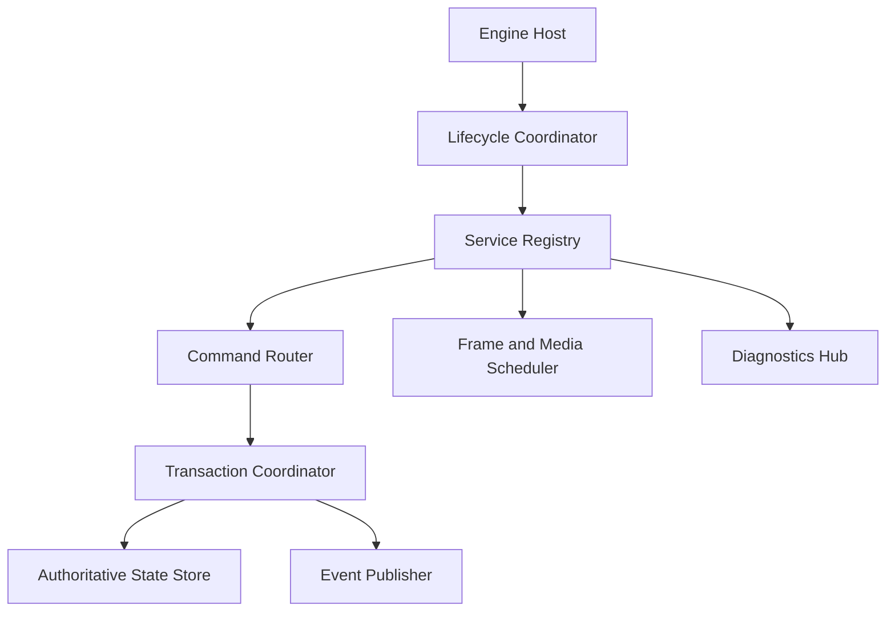

# 100 — Runtime Overview

**Status:** Proposed  
**Audience:** Runtime, engine, UI, media, rendering, platform contributors  
**Canonical:** Yes  
**Required context:** `00-foundations/004-system-overview.md`, `00-foundations/005-domain-model.md`, `00-foundations/007-ai-implementation-contract.md`  
**Related ADRs:** ADR-0005, ADR-0006, ADR-0007, ADR-0008, ADR-0009, ADR-0010

---

## 1. Purpose

The runtime is the authoritative coordinator of a Mirae engine session.

It owns the application-level lifecycle and provides the execution environment in which domain state, media services, rendering, audio, outputs, persistence, diagnostics, and platform adapters cooperate.

The runtime is not a monolithic implementation object. It is a composition root and a set of explicit service contracts.

---

## 2. Goals

The runtime MUST:

- provide one authoritative owner for mutable production state;
- coordinate startup, steady-state operation, recovery, and shutdown;
- serialize domain mutations through commands and transactions;
- publish ordered committed events;
- maintain engine session and state generations;
- supervise subsystem lifecycles;
- keep critical paths independent from UI timing;
- isolate failures where possible;
- expose structured health and diagnostics;
- support UI reconnect without restarting active outputs;
- remain testable without real devices or a real GPU.

---

## 3. Non-Goals

The runtime MUST NOT:

- implement UI rendering;
- own persisted schema details directly;
- contain platform-specific capture logic;
- expose FFmpeg, `wgpu`, or OS handles through domain contracts;
- become the implementation location for every subsystem;
- use an unbounded global event bus;
- depend on React lifecycle;
- block critical callbacks on command processing.

---

## 4. Runtime Composition



The engine host constructs the runtime. The lifecycle coordinator starts and stops services in dependency order. Services are accessed through typed interfaces rather than a general service locator in domain code.

---

## 5. Runtime State

The runtime maintains at least:

```rust
pub struct EngineSession {
    pub session_id: EngineSessionId,
    pub started_at: MonotonicInstant,
    pub protocol_version: ProtocolVersion,
    pub state_generation: StateGeneration,
    pub lifecycle_state: EngineLifecycleState,
    pub capability_generation: CapabilityGeneration,
}
```

The exact representation may differ, but the semantics are mandatory.

### 5.1 Session identifier

A new engine process lifetime receives a new session identifier.

The session identifier:

- distinguishes reconnect from continuation;
- invalidates stale UI assumptions;
- scopes runtime-only identifiers;
- appears in command acknowledgements and state messages.

### 5.2 State generation

Every committed authoritative domain-state transaction increments the state generation exactly once.

Runtime metrics and high-frequency diagnostics do not necessarily increment the domain state generation.

### 5.3 Capability generation

Platform or device capability changes use a separate generation so they do not create unrelated project-state revisions.

---

## 6. Service Categories

### 6.1 Core runtime services

- command router;
- transaction coordinator;
- state store;
- event publisher;
- scheduler;
- diagnostics hub;
- lifecycle coordinator.

### 6.2 Domain services

- scene service;
- source service;
- project service;
- output service;
- extension service;
- settings service.

### 6.3 Execution services

- media service;
- renderer;
- audio engine;
- encoder service;
- capture service;
- network runtime.

### 6.4 Infrastructure services

- persistence;
- credential store;
- IPC transport;
- logging and tracing;
- crash context;
- update coordination.

---

## 7. Threading Overview

The runtime distinguishes:

- control thread or control executor;
- render submission thread or executor;
- real-time audio callback thread;
- media worker pool;
- blocking I/O pool;
- network runtime;
- IPC read/write tasks;
- diagnostics aggregation task.

The exact implementation may use threads, async tasks, or platform callbacks. The ownership boundaries remain explicit.

### Invariant

No critical real-time callback waits for the control thread.

---

## 8. Message Classes

The runtime handles:

| Class | Direction | Purpose |
|---|---|---|
| Command | external/internal → runtime | request mutation or controlled operation |
| Acknowledgement | runtime → requester | report command acceptance or rejection |
| Domain event | runtime → subscribers | describe committed state change |
| Runtime event | subsystem → subscribers | describe observed runtime condition |
| Diagnostic event | subsystem → diagnostics | health, warning, error, performance |
| Snapshot | runtime → replica | establish complete state projection |
| Patch | runtime → replica | advance a known projection generation |
| Capability update | platform/runtime → replicas | report support or availability changes |

These classes must not be collapsed into an untyped message map.

---

## 9. Control-Plane Versus Data-Plane

### Control-plane

Contains:

- commands;
- state;
- configuration;
- lifecycle;
- diagnostics;
- capabilities;
- metadata.

### Data-plane

Contains:

- video frames;
- audio blocks;
- encoded packets;
- GPU resources;
- large shared media buffers.

Large media data MUST NOT be serialized through the control IPC protocol. It uses in-process ownership, shared memory, platform interop, or dedicated transports defined by media specifications.

---

## 10. Runtime Invariants

1. Only committed transactions mutate authoritative domain state.
2. Every accepted mutation command produces either a commit or a structured failure.
3. State generations are strictly monotonic within one engine session.
4. Events for committed transactions preserve commit order.
5. All internal queues have capacity and overflow policy.
6. UI disconnection does not transfer state ownership.
7. Runtime services stop in reverse dependency order unless emergency shutdown overrides it.
8. Panic or crash in an auxiliary worker is reported with ownership and restart policy.
9. Blocking I/O never occurs on real-time audio callbacks.
10. Process and thread boundaries do not leak into persisted domain state.

---

## 11. Failure Model

Failures are classified as:

- command validation failure;
- domain conflict;
- unavailable external resource;
- subsystem degradation;
- recoverable worker failure;
- unrecoverable engine failure;
- compatibility failure;
- internal invariant violation.

The runtime must route failures to:

- command acknowledgement;
- state or runtime event;
- diagnostics;
- crash reporting when appropriate;
- recovery policy.

One failure may produce more than one representation, but duplicate user notifications must be avoided at the UI projection layer.

---

## 12. Testability

The runtime must support dependency injection for:

- monotonic clock;
- ID generation;
- persistence;
- platform capabilities;
- media sources;
- renderer;
- audio sink;
- output sinks;
- IPC transport.

Tests must be able to advance deterministic time and inspect committed events.

---

## 13. Required Tests

- startup dependency order;
- shutdown reverse order;
- command ordering;
- generation increments;
- rejected command without state mutation;
- event ordering;
- UI reconnect snapshot;
- bounded queue overflow behavior;
- worker failure isolation;
- emergency shutdown;
- deterministic clock tests;
- duplicate command handling where specified.

---

## 14. AI Implementation Notes

Do not implement the runtime as a single globally mutable struct accessed from every thread.

Prefer typed service handles and explicit message ownership.

Do not route video or audio payloads through the generic event system.

Do not use an unbounded async channel.

Do not increment state generation for metrics-only updates.

Preserve the distinction between engine session, project identity, state generation, and capability generation.
