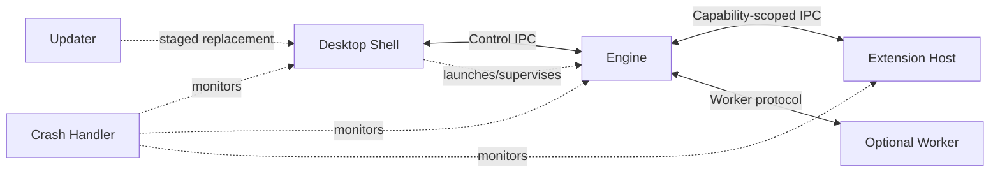

# 101 — Process Model

**Status:** Proposed  
**Audience:** Runtime, shell, IPC, extension, platform contributors  
**Canonical:** Yes  
**Required context:** `100-runtime-overview.md`  
**Related ADRs:** ADR-0005, ADR-0006

---

## 1. Purpose

This document defines Mirae process roles, trust boundaries, supervision, restart behavior, and communication constraints.

---

## 2. Target Processes

### 2.1 Desktop shell process

Owns:

- native top-level windows;
- embedded control UI;
- menus and tray;
- file-open and deep-link events;
- application-level user prompts;
- engine launch and connection;
- recovery UI when engine is unavailable.

The shell is not authoritative for production state.

### 2.2 Engine process

Owns:

- authoritative state;
- runtime coordination;
- scene, media, rendering, audio, output, and project services;
- command validation;
- transactions;
- diagnostics aggregation.

The engine is the primary production process.

### 2.3 Extension host process

Owns:

- extension discovery and loading;
- extension lifecycle;
- manifest and permission enforcement;
- SDK adaptation;
- resource limits;
- extension crash isolation.

### 2.4 Crash handler process

Owns:

- crash monitoring;
- dump capture where supported;
- minimal metadata collection;
- safe handoff to post-crash UI;
- privacy-aware report packaging.

It must not depend on the monitored engine remaining functional.

### 2.5 Updater process

Owns:

- package verification;
- staged update preparation;
- replacement only when target processes are stopped;
- rollback metadata;
- signature validation.

### 2.6 Optional worker processes

May isolate:

- unstable vendor device integrations;
- browser source rendering;
- risky codec paths;
- privilege-sensitive capture;
- experimental media ingest.

A worker process requires a documented failure and restart policy.

---

## 3. Process Graph



---

## 4. Trust Boundaries

| Process | Trust level | Notes |
|---|---|---|
| Engine | High | Owns production state and critical execution |
| Shell/UI | Medium-high | Trusted application code, but may render web content and must not own engine internals |
| Extension host | Restricted | Executes third-party extension code |
| Worker | Restricted by role | May parse untrusted media or integrate unstable devices |
| Crash handler | High but minimal | Handles sensitive crash artifacts |
| Updater | High | Must verify packages and signatures |

Trust level does not imply unrestricted access. Every process receives only required capabilities.

---

## 5. Launch and Authentication

The shell launches the engine with an ephemeral session bootstrap token.

The token:

- authenticates the initial local IPC connection;
- is scoped to one launch;
- is not persisted;
- is not logged;
- is rotated on restart.

Subsequent extension or worker connections use separately scoped credentials or inherited authenticated channels.

Local IPC must not assume that “same machine” means trusted.

---

## 6. Protocol Negotiation

On connection, peers exchange:

- process role;
- protocol major and minor version;
- engine session identifier if known;
- build identifier;
- supported feature flags;
- capability set;
- authentication proof;
- maximum message size;
- compression support if any.

A major version mismatch rejects the connection.

A minor version mismatch may proceed only when compatibility rules explicitly permit it.

---

## 7. Engine Supervision

The shell supervises the engine process.

States include:

```text
NotStarted
Starting
Ready
Degraded
Stopping
Stopped
Crashed
Restarting
Incompatible
```

The shell may offer engine restart after a crash, but must not automatically reopen outputs that could duplicate a stream or recording without recovery policy and user-visible state.

---

## 8. UI Restart

The shell and UI may restart independently from the engine where platform behavior permits.

On reconnect:

1. negotiate protocol;
2. validate engine session;
3. request capabilities;
4. request full state snapshot;
5. resubscribe to event streams;
6. resume diagnostics;
7. discard stale optimistic UI state.

Active outputs remain owned by the engine.

---

## 9. Extension Host Restart

When the extension host crashes:

- engine remains active;
- extension-provided sources or outputs enter a defined unavailable state;
- built-in outputs continue;
- diagnostics identify affected extensions;
- automatic restart is bounded;
- repeated crashes disable the offending extension for the session or until user action.

---

## 10. Worker Restart

A worker restart policy specifies:

- maximum attempts;
- backoff;
- whether media continuity can be preserved;
- state reconstruction;
- when manual intervention is required;
- whether affected source is replaced by a placeholder.

Workers do not retain the only copy of persisted configuration.

---

## 11. Shared Memory

Shared memory may be used for large media payloads.

Requirements:

- handles are capability-scoped;
- ownership and release are explicit;
- sizes are validated;
- generations prevent stale reuse;
- media metadata remains in typed protocol messages;
- a crashed peer cannot cause unbounded retained allocations;
- secrets are not placed in shared buffers unless encrypted and specified.

---

## 12. Process Shutdown

Normal shutdown order:

1. shell requests engine shutdown;
2. engine enters draining state;
3. outputs stop or flush within policy;
4. project recovery state is persisted;
5. workers and extension host stop;
6. engine confirms stopped;
7. shell exits;
8. updater may run if staged.

Forced termination occurs after bounded timeout and records which stage failed.

---

## 13. Invariants

1. The UI never becomes authoritative if the engine disconnects.
2. The engine can reject incompatible peers.
3. Extension code does not load into the engine process by default.
4. Large media data does not traverse generic control IPC.
5. Every child process has a supervisor.
6. Restart attempts are bounded.
7. Process credentials are ephemeral and role-scoped.
8. A crashed auxiliary process cannot corrupt project persistence directly.
9. Engine restart creates a new session identifier.
10. Process topology is not serialized into projects.

---

## 14. Required Tests

- protocol major mismatch;
- invalid bootstrap token;
- engine crash and shell recovery;
- UI reconnect during active output;
- extension host repeated crash;
- worker restart backoff;
- shutdown timeout;
- stale shared-memory generation;
- maximum IPC message rejection;
- child-process orphan cleanup.

---

## 15. AI Implementation Notes

Do not use localhost TCP without authentication as the default local trust model.

Do not expose a general “execute command” endpoint to extensions.

Do not automatically resume external streaming after engine crash unless a dedicated recovery specification allows it.

Keep process-role enums and protocol negotiation explicit and versioned.
