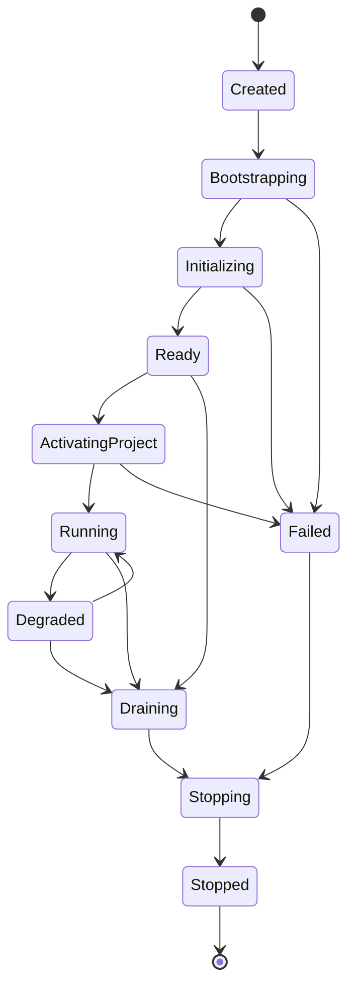

# 102 — Engine Lifecycle

**Status:** Proposed  
**Audience:** Runtime, project, output, media, platform contributors  
**Canonical:** Yes  
**Required context:** `100-runtime-overview.md`, `101-process-model.md`  
**Related ADRs:** ADR-0005, ADR-0010

---

## 1. Purpose

This document defines the engine lifecycle state machine and the ordering guarantees for startup, project activation, steady-state operation, degradation, and shutdown.

---

## 2. Lifecycle States

```rust
pub enum EngineLifecycleState {
    Created,
    Bootstrapping,
    Initializing,
    Ready,
    ActivatingProject,
    Running,
    Degraded,
    Draining,
    Stopping,
    Stopped,
    Failed,
}
```

Names may differ, but semantics and transitions must remain explicit.

---

## 3. State Machine



Not every subsystem failure transitions the engine to `Failed`. Local failures use degraded runtime state.

---

## 4. Bootstrapping

Bootstrapping performs only minimal process-safe setup:

- parse validated launch configuration;
- initialize monotonic clock;
- establish session identifier;
- initialize crash context;
- initialize minimal logging;
- validate executable and resource layout;
- create runtime root cancellation token.

Bootstrapping must not open a project or start outputs.

---

## 5. Initialization

Initialization proceeds in dependency order:

1. configuration and feature flags;
2. secure credential adapter;
3. diagnostics and tracing;
4. IPC server;
5. platform capability probe;
6. project library;
7. renderer device abstraction;
8. audio backend;
9. media services;
10. capture registry;
11. output registry;
12. extension coordinator;
13. runtime scheduler.

A subsystem may report `Unavailable` or `Degraded` without failing the whole engine when the missing capability is optional.

---

## 6. Ready State

`Ready` means:

- protocol connections may be accepted;
- capabilities are available;
- project library is accessible;
- no project is necessarily active;
- no output is active;
- commands allowed in ready state are explicitly whitelisted.

Examples of allowed commands:

- list projects;
- create project;
- open project;
- query capabilities;
- configure application-level settings;
- request diagnostics.

---

## 7. Project Activation

Project activation is transactional at the application level.

Stages:

1. load bytes;
2. validate schema;
3. migrate into current schema in memory;
4. validate domain references;
5. resolve assets and credentials;
6. construct authoritative project state;
7. prepare runtime source definitions;
8. compile initial scene projections;
9. publish active project snapshot;
10. enter `Running`.

Unavailable external resources do not necessarily fail activation. They produce unresolved or unavailable runtime states.

The current active project is not replaced until the new project reaches the commit stage.

---

## 8. Running State

In `Running`:

- domain commands are accepted according to capability and state;
- scheduler runs;
- sources may be active;
- outputs may start and stop;
- autosave operates;
- UI may connect or disconnect;
- extensions may operate within grants;
- diagnostics are continuously aggregated.

---

## 9. Degraded State

The engine enters `Degraded` when core operation continues but one or more significant capabilities are impaired.

Examples:

- renderer fallback active;
- audio backend restarted;
- extension host unavailable;
- one output repeatedly failing;
- device service unavailable;
- autosave temporarily blocked;
- GPU memory pressure requiring reduced quality.

Degraded state includes structured reasons and does not replace subsystem-level health.

---

## 10. Draining

Draining rejects new work that would prolong shutdown.

Allowed operations may include:

- stop output;
- flush recording;
- save recovery snapshot;
- cancel pending non-critical work;
- query shutdown status.

Disallowed operations include:

- start output;
- open project;
- add source;
- begin migration;
- install extension.

---

## 11. Shutdown Deadlines

Each stage has a bounded deadline.

Example policy categories:

- output flush deadline;
- project save deadline;
- worker stop deadline;
- renderer idle deadline;
- process exit deadline.

Exact durations are configuration and platform concerns, but no stage may wait forever.

When a deadline expires:

- record diagnostic;
- advance to forced cleanup;
- preserve recovery data where possible;
- identify the owning subsystem.

---

## 12. Cancellation

Long-running operations receive structured cancellation.

Cancellation semantics:

- command cancellation does not imply transaction rollback after commit;
- migration cancellation is allowed only at safe checkpoints;
- output start cancellation cleans partial resources;
- shutdown cancellation is not generally supported after draining begins;
- cancellation is observable through acknowledgement or event.

---

## 13. Crash Recovery Context

The engine maintains minimal crash context:

- session ID;
- active project ID;
- last committed state generation;
- active output IDs;
- lifecycle state;
- recent bounded diagnostics;
- current migration or save phase;
- build and protocol versions.

It must exclude secrets and raw media.

---

## 14. Invariants

1. Outputs never start before initialization and project validation.
2. Active project replacement is atomic at the domain level.
3. `Stopped` is terminal for an engine session.
4. Shutdown waits are bounded.
5. Optional capability failure does not automatically fail the engine.
6. Lifecycle transitions are serialized.
7. Every lifecycle transition is observable in diagnostics.
8. A new engine process creates a new session.
9. Crash context excludes credentials.
10. `Running` does not imply every source or output is healthy.

---

## 15. Required Tests

- complete startup;
- optional subsystem unavailable;
- mandatory subsystem failure;
- project activation with missing asset;
- project activation rollback;
- degraded to running recovery;
- shutdown while output active;
- shutdown timeout;
- cancellation during output start;
- lifecycle command rejection;
- crash context redaction.

---

## 16. AI Implementation Notes

Use a single serialized lifecycle authority.

Do not let independent services transition global lifecycle directly; they report health and request transitions through the coordinator.

Do not replace the active project before activation succeeds.

Do not model every source failure as an engine lifecycle failure.
