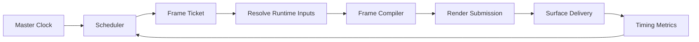

# 103 — Frame Scheduler

**Status:** Proposed  
**Audience:** Runtime, rendering, media, audio, output contributors  
**Canonical:** Yes  
**Required context:** `100-runtime-overview.md`, future `03-media/304-master-clock-and-timebase.md`  
**Related ADRs:** ADR-0008

---

## 1. Purpose

The frame scheduler coordinates when Mirae prepares, renders, and delivers video frames for preview, program, recording, streaming, replay, and other surfaces.

It does not define media timestamp semantics in full. The master clock and timebase specification remains authoritative for timing math.

---

## 2. Goals

The scheduler MUST:

- schedule surfaces independently;
- use explicit timing targets;
- avoid coupling to UI refresh;
- support different output frame rates;
- bound queued work;
- classify late and dropped frames;
- coalesce redundant invalidations;
- expose timing diagnostics;
- degrade predictably under overload;
- support deterministic simulation in tests.

---

## 3. Non-Goals

The scheduler MUST NOT:

- perform scene mutation;
- decode media itself;
- own GPU resources;
- block on encoder completion indefinitely;
- use wall-clock time for media ordering;
- assume one global frame rate for every output;
- render every surface whenever any state changes.

---

## 4. Scheduling Domains

Mirae may schedule:

- preview surface;
- program surface;
- each recording profile;
- each streaming output;
- replay composition;
- screenshots or thumbnails;
- virtual camera output.

Surfaces may share rendered intermediates when compatible.

---

## 5. Schedule Request

Conceptual model:

```rust
pub struct SurfaceSchedule {
    pub surface_id: SurfaceId,
    pub cadence: Cadence,
    pub priority: SchedulePriority,
    pub latency_class: LatencyClass,
    pub overflow_policy: OverflowPolicy,
    pub active: bool,
}
```

Cadence may be:

- fixed frame rate;
- display-vsync driven;
- source-driven;
- on-demand;
- externally clocked.

---

## 6. Frame Ticket

Each scheduled frame creates a ticket:

```rust
pub struct FrameTicket {
    pub frame_id: FrameId,
    pub surface_id: SurfaceId,
    pub target_present_time: MediaTime,
    pub state_generation: StateGeneration,
    pub scene_generation: SceneGeneration,
    pub capability_generation: CapabilityGeneration,
    pub deadline: MonotonicInstant,
}
```

The ticket identifies the state used for compilation.

A late completion may be discarded if a newer ticket supersedes it under the surface policy.

---

## 7. Pipeline



Each stage must report timestamps or durations sufficient to classify delay.

---

## 8. Deadline Model

For each frame:

```text
target presentation time
- estimated delivery latency
- estimated GPU execution
- estimated compile time
= work start target
```

Estimates use bounded moving statistics and must not oscillate aggressively.

The scheduler should distinguish:

- scheduler wake-up lateness;
- source frame unavailable;
- scene compilation lateness;
- GPU queue lateness;
- encoder backpressure;
- sink/network lateness.

---

## 9. Priority

Suggested priority order:

1. active live program outputs;
2. recording and replay integrity;
3. program preview;
4. operator preview;
5. thumbnails and background previews.

Priority does not permit starvation. Low-priority work may be rate-limited or coalesced.

---

## 10. Overflow Policies

Supported policies include:

- `DropNewest`;
- `DropOldest`;
- `CoalesceLatest`;
- `BackpressureBounded`;
- `DegradeQuality`;
- `StopSurface`.

Every surface type specifies one policy.

Examples:

- preview: coalesce latest;
- live video output: drop according to cadence and preserve current timing;
- screenshot: bounded backpressure or explicit failure;
- thumbnail: drop newest or coalesce;
- recording: policy depends on encoder and container guarantees.

---

## 11. Scene Invalidation

State changes produce invalidation descriptors, not immediate uncontrolled renders.

Invalidation examples:

- transform-only;
- source frame changed;
- effect parameters changed;
- graph topology changed;
- output configuration changed;
- color pipeline changed;
- surface resized.

The compiler uses invalidation to reuse safe derived state.

---

## 12. Multi-Rate Output

Two outputs may use different frame rates.

The scheduler must:

- assign independent frame tickets;
- select source frames against target time;
- share compatible scene compilation and GPU intermediates only when timestamp semantics permit;
- avoid forcing all outputs to the highest rate;
- preserve per-output diagnostics.

---

## 13. Backpressure

Backpressure may originate from:

- GPU queue saturation;
- encoder queue;
- muxer;
- network sink;
- file I/O;
- shared memory consumer.

Backpressure is reported to the scheduler through a bounded structured signal.

The scheduler does not allow downstream queues to grow without limit.

---

## 14. Quality Degradation

A surface may reduce cost through specified steps:

1. skip nonessential preview frames;
2. lower preview resolution;
3. disable expensive preview-only effects;
4. reduce thumbnail frequency;
5. select lower-cost scaling;
6. stop nonessential surfaces.

Program output quality must not change silently. Any adaptive output degradation requires explicit configuration and diagnostics.

---

## 15. Threading

The scheduler control loop may run on a dedicated high-priority thread or real-time-aware executor, but it must not execute heavy compilation or GPU work directly.

It dispatches bounded work to owning executors.

---

## 16. Metrics

Required metrics:

- scheduled frames;
- delivered frames;
- dropped frames by reason;
- late frames by stage;
- compile duration;
- GPU queue duration;
- present/encode delivery delay;
- queue depth;
- coalesced invalidations;
- active surfaces;
- clock drift indicators.

---

## 17. Invariants

1. UI animation timing does not drive output cadence.
2. Every frame ticket has a target time and surface.
3. Work queues are bounded.
4. Drops have explicit reason codes.
5. Surface schedules are independent.
6. Runtime state used by a frame is generation-identified.
7. The scheduler does not mutate project state.
8. Wall-clock jumps do not reorder media.
9. Low-priority surfaces cannot exhaust all capacity.
10. Backpressure cannot grow memory without bound.

---

## 18. Required Tests

- fixed cadence;
- multi-rate surfaces;
- coalesced preview;
- late GPU submission;
- encoder backpressure;
- source frame missing;
- overload priority;
- deterministic virtual clock;
- wall-clock adjustment;
- surface start/stop race;
- state generation rollover behavior;
- bounded queue saturation.

---

## 19. AI Implementation Notes

Use a testable monotonic/virtual clock abstraction.

Do not use `setInterval`, UI timers, or React effects as the production scheduler.

Do not put expensive work on the scheduler loop.

Every channel introduced here needs capacity, overflow policy, and metrics.
