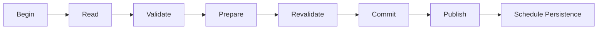

# 107 — Transactions

**Status:** Proposed  
**Audience:** Runtime, domain, persistence, undo/redo contributors  
**Canonical:** Yes  
**Required context:** `104-command-system.md`, `106-state-store.md`  
**Related ADRs:** ADR-0010

---

## 1. Purpose

Transactions guarantee that related authoritative changes commit atomically or have no visible effect.

They are in-memory domain transactions, not necessarily database transactions.

---

## 2. Transaction Scope

A transaction may include:

- project domain state mutation;
- session production state mutation;
- undo record generation;
- domain event generation;
- state patch generation;
- persistence dirty-state marking.

External side effects are not performed inside the commit-critical section.

---

## 3. Transaction Phases

### 3.1 Begin

Capture:

- command ID;
- actor;
- expected generation;
- correlation ID;
- transaction category.

### 3.2 Read

Read immutable state and required indexes.

### 3.3 Validate

Validate permissions, lifecycle, references, and domain preconditions.

### 3.4 Prepare

Build candidate changes, events, patches, and undo metadata.

### 3.5 Revalidate

Before commit, confirm generation and conflict-sensitive preconditions.

### 3.6 Commit

Atomically install new state and generation.

### 3.7 Publish

Publish acknowledgement, patches, and events in defined order.

### 3.8 Persistence scheduling

Mark project dirty and schedule autosave or explicit save as required.

---

## 4. Atomicity Boundary

Atomicity means subscribers cannot observe a partial authoritative state.

It does not mean external devices, files, or remote services participate in the same atomic transaction.

Example: changing an output profile commits intent. Restarting the external encoder is a follow-up operation with observable state.

---

## 5. External Side Effects

For side-effecting commands, use one of these patterns.

### 5.1 Intent then operation

1. commit desired state or operation record;
2. perform external operation;
3. publish progress;
4. commit observed result.

### 5.2 Prepare then commit

1. prepare external resource without making it live;
2. revalidate state;
3. commit state;
4. atomically activate resource if supported;
5. clean up on failure.

### 5.3 Compensating action

When external operation cannot be atomic, define a compensating action and failure state.

---

## 6. Nested Transactions

Nested public transactions are prohibited.

A command handler may call domain functions that contribute changes to the same transaction context.

A service must not begin an independent commit while participating in another transaction.

---

## 7. Conflict Detection

Conflict sources include:

- expected generation mismatch;
- entity deleted or changed;
- project switched;
- lifecycle changed;
- capability invalidated;
- output operation already active;
- migration or save lock.

Conflicts are structured and do not use generic internal errors.

---

## 8. Undo Integration

An undoable transaction produces an undo record tied to:

- committed generation;
- command and actor;
- affected entities;
- inverse or prior state;
- merge/coalescing metadata;
- invalidation conditions.

Undo is itself a command and transaction.

---

## 9. Event and Patch Ordering

After commit:

1. command result becomes durable in runtime memory;
2. state generation is visible;
3. state patch is available;
4. semantic events are published;
5. acknowledgement is sent according to protocol contract.

The exact wire ordering may differ, but clients must have enough metadata to reconcile. The implementation must define one consistent ordering and test it.

---

## 10. Failure Before Commit

Failure before commit:

- does not increment generation;
- does not publish committed domain events;
- does not produce an undo record;
- cleans prepared resources;
- returns structured rejection or failure.

---

## 11. Failure After Commit

Failure after commit may occur in:

- event delivery;
- UI patch delivery;
- autosave scheduling;
- external operation;
- diagnostics publishing.

The state remains committed.

Recovery mechanisms must not pretend the transaction rolled back unless a new compensating transaction commits.

---

## 12. Transaction Duration

The final serialized commit section must be short and bounded.

Prohibited while holding commit authority:

- disk I/O;
- network I/O;
- device enumeration;
- encoder creation;
- shader compilation;
- waiting for GPU;
- synchronous IPC;
- extension execution.

---

## 13. Invariants

1. Commit is all-or-nothing for authoritative state.
2. Generation increments exactly once per commit.
3. External side effects are outside the critical commit section.
4. Nested commits are prohibited.
5. Undo records correspond only to committed transactions.
6. Pre-commit failure emits no committed event.
7. Post-commit delivery failure does not revert state implicitly.
8. Conflicts are explicit.
9. Commit duration is bounded.
10. Transaction output includes sufficient correlation metadata.

---

## 14. Required Tests

- multi-entity atomic change;
- validation failure;
- generation conflict;
- external prepare failure;
- post-commit event delivery failure;
- undo creation;
- nested transaction rejection;
- concurrent command serialization;
- project switch conflict;
- commit duration benchmark;
- compensating action path.

---

## 15. AI Implementation Notes

Do not hold the state commit lock while calling external services.

Do not simulate rollback after commit by mutating state silently.

Do not publish domain events before commit.

Model long-running work as operations with explicit state.
