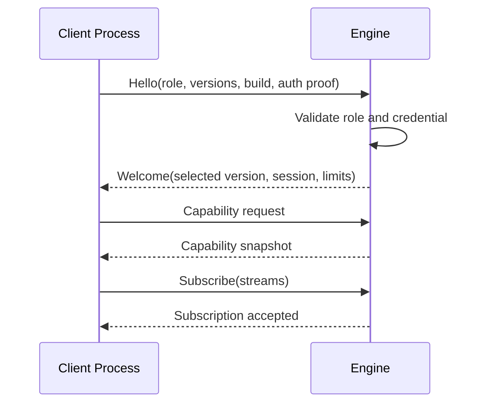

# 108 — IPC Protocol

**Status:** Proposed  
**Audience:** Runtime, shell, UI, extension, worker contributors  
**Canonical:** Yes  
**Required context:** `101-process-model.md`, `104-command-system.md`, `105-event-system.md`  
**Related ADRs:** ADR-0006, ADR-0008, ADR-0009

---

## 1. Purpose

The IPC protocol connects Mirae processes through typed, authenticated, versioned messages.

It carries control-plane data, not unbounded media payloads.

---

## 2. Protocol Requirements

The protocol MUST provide:

- process-role authentication;
- version negotiation;
- request/response correlation;
- command submission;
- acknowledgements;
- event streams;
- snapshots and patches;
- capability negotiation;
- bounded message sizes;
- structured errors;
- cancellation where supported;
- backpressure;
- disconnect detection;
- reconnect recovery.

---

## 3. Transport Independence

The protocol is defined independently from transport.

Possible transports:

- Unix domain socket;
- Windows named pipe;
- platform local IPC;
- inherited secure channel;
- test in-memory transport.

Transport adapters must preserve protocol semantics.

---

## 4. Framing

Each message frame includes:

```rust
pub struct FrameHeader {
    pub magic: [u8; 4],
    pub protocol_major: u16,
    pub protocol_minor: u16,
    pub message_type: u16,
    pub flags: u16,
    pub payload_length: u32,
    pub correlation_id: u128,
}
```

Exact binary layout may change before acceptance, but framing must be bounded and validated before allocation.

---

## 5. Serialization

The protocol uses a schema-driven serialization format selected for:

- Rust and TypeScript generation;
- explicit optional fields;
- version evolution;
- bounded decoding;
- deterministic fixtures;
- no arbitrary code execution.

The chosen format requires an ADR if not already covered.

JSON may be used for diagnostics or development tooling, but is not automatically the canonical high-frequency IPC encoding.

---

## 6. Handshake



No command is accepted before handshake completion.

---

## 7. Message Families

- `Hello`, `Welcome`, `Reject`;
- `Request`, `Response`, `Cancel`;
- `Command`, `CommandAck`;
- `Subscribe`, `Unsubscribe`;
- `Event`;
- `StateSnapshot`;
- `StatePatch`;
- `CapabilitySnapshot`, `CapabilityPatch`;
- `Ping`, `Pong`;
- `FlowControl`;
- `DisconnectNotice`.

Each message family has a stable numeric or schema identity.

---

## 8. Versioning

### 8.1 Major version

Major mismatch means incompatible protocol and connection rejection.

### 8.2 Minor version

Minor versions may add optional messages or fields.

The selected minor version is the highest mutually supported compatible version.

### 8.3 Feature negotiation

Optional features are advertised explicitly.

A peer must not infer support from version alone when a capability flag exists.

---

## 9. Message Size

Every connection defines:

- maximum frame size;
- maximum decompressed size;
- maximum nesting depth;
- maximum collection length;
- maximum string length where relevant.

Oversized frames are rejected before large allocation.

Large media payloads use dedicated data-plane mechanisms.

---

## 10. Backpressure

Each connection has bounded outbound and inbound queues.

Priority classes:

1. lifecycle and safety;
2. command acknowledgements;
3. state synchronization;
4. critical runtime events;
5. diagnostics;
6. low-priority metrics.

Low-priority traffic may be coalesced or dropped with counters.

State patches cannot be silently dropped while maintaining synchronized status. On gap, replica is marked stale and resnapshot is required.

---

## 11. Authentication and Authorization

Handshake authenticates process identity.

Each request is additionally authorized by:

- process role;
- actor context;
- capability grant;
- current engine lifecycle;
- project policy where applicable.

Authentication does not grant all commands.

---

## 12. Reconnect

A reconnecting client provides:

- last engine session ID;
- last event sequence;
- last state generation;
- last capability generation;
- supported snapshot schema.

The engine chooses:

- resume with retained patches/events;
- send full snapshots;
- reject due to incompatible session or protocol.

---

## 13. Cancellation

Cancellation applies to cancellable in-flight requests or operations.

It does not retroactively undo committed commands.

A cancel response indicates:

- cancelled before start;
- cancellation requested;
- too late;
- not cancellable;
- unknown operation.

---

## 14. Error Contract

IPC errors include:

- code;
- safe message;
- subsystem;
- retryability;
- correlation ID;
- optional details schema;
- redacted diagnostic reference.

Raw panic text and secrets never cross IPC.

---

## 15. Observability

Metrics include:

- connections by role;
- handshake failures;
- message counts and bytes;
- queue depth;
- dropped/coalesced messages;
- decode failures;
- request latency;
- reconnect outcomes;
- snapshot frequency;
- protocol errors.

---

## 16. Invariants

1. No command before authenticated handshake.
2. Protocol is typed and versioned.
3. Frames are size-bounded.
4. Control IPC does not carry raw video/audio streams.
5. State gaps trigger resynchronization.
6. Queues are bounded and prioritized.
7. Authentication and authorization are separate.
8. Cancellation does not undo committed state.
9. Errors are structured and redacted.
10. Transport details do not leak into domain contracts.

---

## 17. Required Tests

- handshake success;
- invalid credential;
- major mismatch;
- minor negotiation;
- malformed frame;
- oversized frame;
- decode bounds;
- outbound backpressure;
- reconnect with retained patches;
- reconnect requiring snapshot;
- cancellation race;
- extension unauthorized command;
- transport disconnect;
- fuzzing of frame decoder.

---

## 18. AI Implementation Notes

Do not implement IPC as arbitrary method names with unvalidated JSON.

Do not allocate based on untrusted length before checking limits.

Do not equate successful local connection with authorization.

Generate Rust and TypeScript types from one canonical schema when possible.
