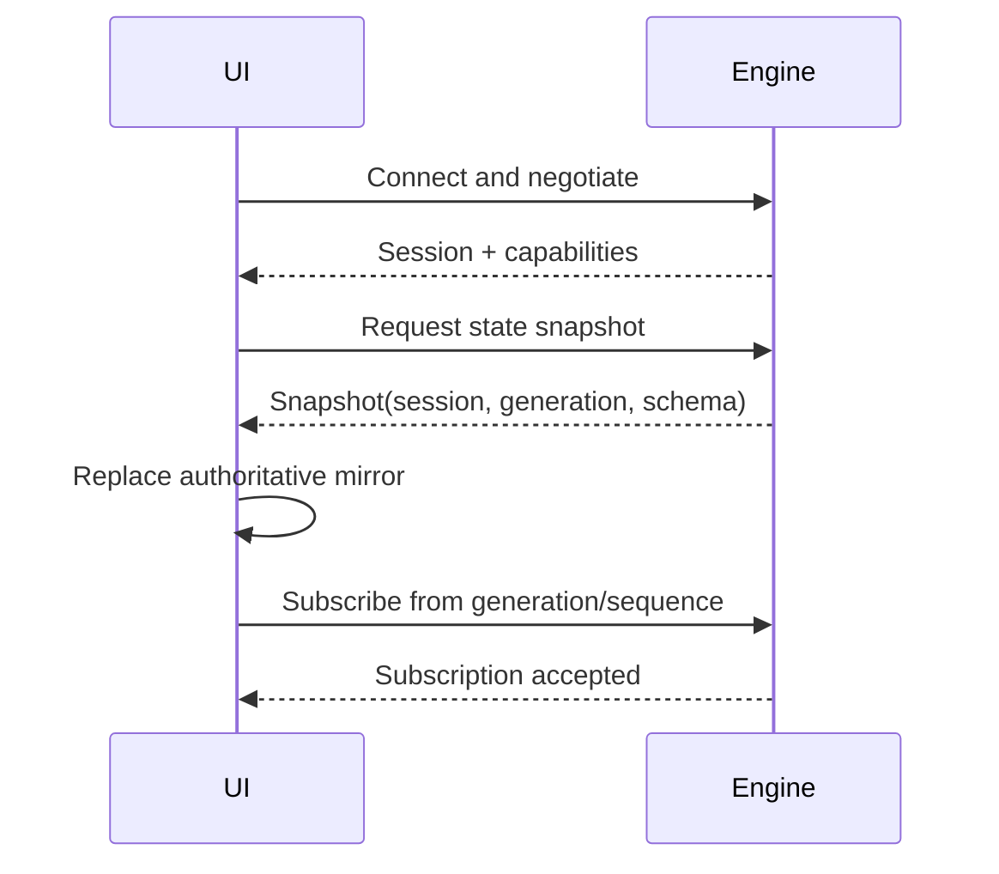
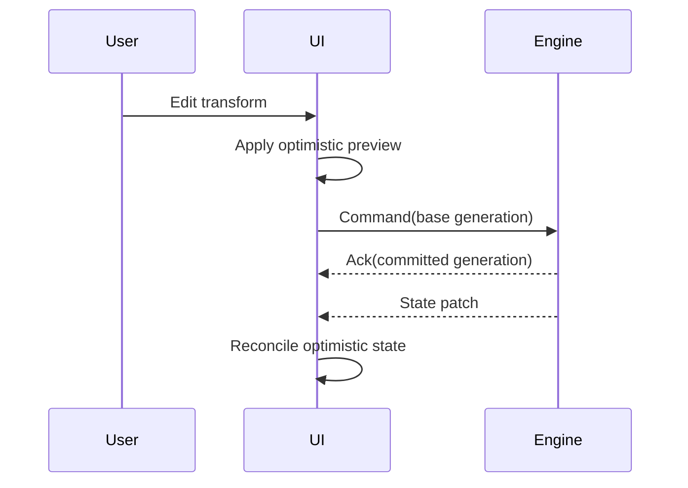

# 109 — UI–Engine Synchronization

**Status:** Proposed  
**Audience:** UI, runtime, IPC, state contributors  
**Canonical:** Yes  
**Required context:** `106-state-store.md`, `108-ipc-protocol.md`  
**Related ADRs:** ADR-0009

---

## 1. Purpose

This document defines how the React control UI mirrors engine state without becoming authoritative.

---

## 2. Principles

1. Engine state is authoritative.
2. UI state is a projection.
3. View-local state remains local.
4. Optimistic mutation is allowed only with rollback.
5. Session and generation metadata are mandatory.
6. Sequence gaps invalidate synchronization.
7. Reconnect uses snapshot or retained patch recovery.
8. High-frequency metrics use separate projections from project state.

---

## 3. UI State Categories

### 3.1 Authoritative mirror

Replicated from engine:

- scenes;
- sources;
- output profiles;
- program/preview selection;
- active operations;
- source/output status;
- capabilities.

### 3.2 View-local state

Owned by UI:

- open panel;
- scroll position;
- selection marquee;
- local text field draft;
- hover state;
- drag preview before commit;
- temporary dialogs.

### 3.3 Optimistic state

Temporary predicted state for low-risk interaction.

Examples:

- transform drag;
- rename field;
- reorder preview.

Optimistic state must retain:

- base generation;
- command ID;
- rollback value;
- conflict behavior.

### 3.4 Ephemeral metrics

High-frequency values:

- audio meters;
- frame timing;
- bitrate;
- queue depth.

Metrics use rate-limited dedicated stores and do not trigger full application rerenders.

---

## 4. Initial Synchronization

The UI is considered synchronized only after snapshot install and subscription acknowledgement.

---

## 5. Patch Application

A patch applies only when:

- engine session matches;
- projection schema matches;
- local generation equals patch `from_generation`;
- patch operations validate;
- resulting generation equals `to_generation`.

On failure:

1. mark mirror stale;
2. stop applying dependent patches;
3. request fresh snapshot;
4. preserve view-local state where safe;
5. discard incompatible optimistic state.

---

## 6. Command Flow

The acknowledgement alone does not replace the authoritative patch.

---

## 7. Optimistic Interaction Rules

Optimistic behavior is allowed when:

- visual latency would harm interaction;
- operation is reversible;
- conflict is detectable;
- final state is engine-confirmed;
- no external side effect occurs before commit.

Examples suitable for optimism:

- transform drag;
- volume fader preview;
- reorder placeholder.

Examples unsuitable by default:

- start stream;
- delete project;
- credential changes;
- schema migration;
- extension permission grant.

---

## 8. Conflict Handling

On conflict:

- cancel or freeze the optimistic layer;
- show current authoritative result;
- preserve user draft if it can be reapplied safely;
- offer retry only when semantics remain valid;
- never overwrite silently.

For continuous controls, the UI may issue a new command based on latest generation after explicit reconciliation policy.

---

## 9. Drag and Continuous Input

Continuous input should not submit one authoritative command for every pointer event.

Preferred pattern:

- local preview at display rate;
- bounded/coalesced preview updates if engine preview is needed;
- final committed command on interaction end;
- optional transaction merge for intermediate updates;
- cancellation restores authoritative value.

For audio controls requiring live engine response, use a dedicated bounded control stream with final committed state.

---

## 10. Event Handling

UI receives:

- semantic events for notifications and targeted behavior;
- state patches for mirror updates;
- runtime events for status;
- diagnostics;
- operation progress;
- metrics streams.

Semantic event handlers must not independently reconstruct canonical state when a state patch exists.

---

## 11. Reconnect

On disconnect:

- mark engine-dependent controls unavailable or pending;
- retain view-local state;
- stop assuming optimistic commits;
- display active-output uncertainty honestly;
- attempt bounded reconnect through shell.

On reconnect with same session:

- resume if retained patches cover the gap;
- otherwise request snapshot.

On new session:

- discard engine mirror;
- discard stale optimistic mutations;
- establish new snapshot;
- re-evaluate active project and outputs.

---

## 12. Store Architecture

The UI SHOULD separate stores:

- authoritative project mirror;
- runtime status;
- capabilities;
- diagnostics;
- high-frequency metrics;
- view-local state;
- pending commands.

This prevents audio meters or bitrate updates from rerendering the full scene editor.

---

## 13. Accessibility

Synchronization state must be accessible.

Examples:

- pending save status announced without excessive repetition;
- rejected command associated with the affected control;
- reconnect state available to screen readers;
- color is not the only indication of stale or degraded state;
- optimistic changes do not make focus jump unexpectedly.

---

## 14. Invariants

1. Engine is authoritative.
2. UI mirror is session- and generation-scoped.
3. Patch gaps cause resynchronization.
4. View-local state does not enter project commands unless intentional.
5. Optimistic state has rollback.
6. Acknowledgement and patch remain distinct.
7. Metrics are isolated from project-state rerenders.
8. New engine session invalidates old mirror.
9. External side effects are not optimistically assumed successful.
10. Conflicts are visible.

---

## 15. Required Tests

- initial snapshot;
- ordered patches;
- patch gap;
- duplicate patch;
- new session reconnect;
- optimistic success;
- optimistic rejection;
- generation conflict;
- continuous drag coalescing;
- UI disconnect during active output;
- metric update isolation;
- accessible error announcement.

---

## 16. AI Implementation Notes

Do not make Zustand, Redux, React Context, or component state authoritative for engine data.

Do not treat command acknowledgement as the state update.

Do not fire one IPC command per pointer move without coalescing policy.

Keep metrics in a separate high-frequency path.
