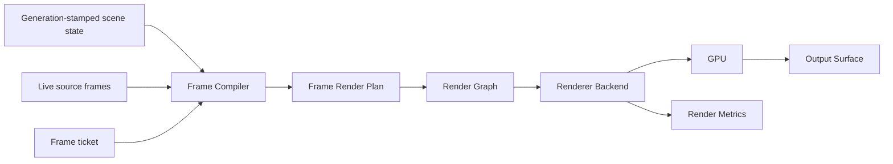

# 200 — Rendering Overview

**Status:** Proposed  
**Audience:** Rendering, runtime, media, UI, output contributors  
**Canonical:** Yes  
**Required context:** `00-foundations/003-design-principles.md`, `00-foundations/004-system-overview.md`, `01-runtime/103-frame-scheduler.md`  
**Related ADRs:** ADR-0002, ADR-0004, ADR-0011, ADR-0012, ADR-0013, ADR-0014, ADR-0015

---

## 1. Purpose

The rendering subsystem converts semantic production state and live source frames into GPU-produced surfaces for preview, program, recording, streaming, replay, screenshots, thumbnails, and virtual outputs.

The rendering subsystem is GPU-first, generation-aware, bounded, observable, and independent from UI frame timing.

---

## 2. Responsibilities

The rendering subsystem owns:

- renderer device and queue abstraction;
- scene-to-frame compilation;
- render graph construction;
- render pass scheduling;
- GPU resource creation and pooling;
- shader and pipeline management;
- compositing;
- masks and blend modes;
- scaling and filtering;
- text and vector graphics rendering;
- color conversion and tone mapping;
- effect and transition execution;
- preview and program surfaces;
- render diagnostics;
- device-loss recovery.

---

## 3. Non-Responsibilities

The rendering subsystem does not own:

- project persistence;
- source capture;
- media decode;
- audio mixing;
- network output;
- authoritative scene mutation;
- UI layout;
- output retry policy;
- credential handling.

It consumes domain and runtime inputs through stable interfaces.

---

## 4. Pipeline



The scene graph is semantic. The frame render plan is resolved. The render graph is executable. The backend records and submits GPU work.

---

## 5. Rendering Layers

### 5.1 Scene graph

Describes user intent:

- hierarchy;
- source instances;
- transforms;
- visibility;
- masks;
- effects;
- blend behavior;
- nested scenes.

### 5.2 Frame compiler

Resolves:

- active scene state;
- runtime source availability;
- frame timestamps;
- surface requirements;
- transitions;
- color pipeline;
- effect configuration.

It produces a renderer-independent frame render plan.

### 5.3 Render graph

Defines:

- passes;
- resources;
- dependencies;
- lifetimes;
- read/write access;
- ordering;
- reusable intermediates.

### 5.4 Renderer backend

Translates graph execution into `wgpu` operations and platform interop.

### 5.5 Surface delivery

Presents or hands off the rendered result to:

- preview window;
- encoder;
- recorder;
- replay store;
- virtual camera;
- screenshot consumer.

---

## 6. Target Surfaces

Every target surface declares:

```rust
pub struct SurfaceDescriptor {
    pub surface_id: SurfaceId,
    pub extent: PixelExtent,
    pub frame_rate: Rational,
    pub pixel_format: SurfacePixelFormat,
    pub color_space: ColorSpaceId,
    pub alpha_mode: AlphaMode,
    pub latency_class: LatencyClass,
    pub usage: SurfaceUsage,
}
```

Surface descriptors are immutable for one generation. A resize or format change creates a new surface generation.

---

## 7. Frame Input Contract

A render request includes:

- frame ticket;
- state generation;
- scene generation;
- source frame set;
- transition state;
- target surface descriptors;
- capability generation;
- quality policy;
- diagnostic correlation ID.

A frame request must not contain mutable project references that can change during compilation.

---

## 8. Render Determinism

Given the same:

- scene snapshot;
- source frame identities;
- target time;
- surface configuration;
- renderer capabilities;
- shader versions;
- quality policy;

the compiled render plan should be equivalent.

Pixel-identical output across all GPUs is not guaranteed unless a specific golden-test mode defines constrained behavior.

---

## 9. Performance Model

The rendering path must minimize:

- CPU-side frame copies;
- GPU readbacks;
- per-frame heap allocation;
- pipeline creation;
- texture recreation;
- synchronization stalls;
- redundant passes;
- unnecessary high-resolution intermediates.

Performance must be measured per stage:

- compile CPU time;
- graph build time;
- command encoding time;
- GPU execution time;
- queue wait time;
- surface delivery time;
- resource allocation and reuse.

---

## 10. Quality Tiers

The renderer may support explicit quality policies:

- `Production`;
- `Preview`;
- `Thumbnail`;
- `RecoveryFallback`;
- `Diagnostics`.

A quality tier may change:

- intermediate resolution;
- scaling filter;
- effect precision;
- shadow sample count;
- preview-only effect behavior;
- cache strategy.

Production output quality must not silently degrade unless an explicit adaptive policy is enabled.

---

## 11. Resource Ownership

- renderer backend owns device and queue;
- resource manager owns GPU resources and pools;
- render graph owns logical resource lifetimes for one execution;
- source runtimes own source-side acquisition resources;
- surface owner owns presentation or output handoff contract;
- scene graph owns no GPU resource.

---

## 12. Threading

Expected execution domains:

- frame compiler workers;
- render graph builder;
- renderer submission thread;
- asynchronous GPU completion callbacks;
- shader compilation worker;
- resource cleanup task.

GPU queue submission is serialized according to backend requirements.

The real-time audio thread does not interact directly with renderer locks.

---

## 13. Error Categories

- unsupported capability;
- invalid scene graph;
- missing source frame;
- shader compile failure;
- pipeline creation failure;
- resource allocation failure;
- surface outdated;
- device lost;
- encoder interop failure;
- internal graph invariant failure.

Errors are classified as:

- frame-local recoverable;
- surface-local recoverable;
- subsystem degraded;
- renderer restart required;
- engine-fatal only when recovery cannot preserve operation.

---

## 14. Global Invariants

1. Scene graph contains no GPU objects.
2. Render graph is derived state.
3. Every GPU resource is generation-tracked.
4. Every transient allocation is bounded or pooled.
5. Preview and program can schedule independently.
6. Device loss does not corrupt project state.
7. Rendering does not mutate authoritative domain state.
8. Source frame ownership is explicit.
9. Color space is explicit at every surface boundary.
10. Render failures produce structured diagnostics.

---

## 15. Required Tests

- simple scene;
- nested scene;
- transform hierarchy;
- source unavailable fallback;
- multi-surface rendering;
- surface resize;
- resource reuse;
- graph dependency validation;
- shader failure;
- device loss;
- HDR/SDR color path;
- preview/program divergence;
- deterministic compile fixture;
- performance baseline.

---

## 16. AI Implementation Notes

Do not bypass the frame compiler by issuing GPU work directly from scene objects.

Do not store `wgpu` textures in persisted or domain scene structures.

Do not create pipelines or large textures per frame without a measured and documented reason.

Preserve explicit surface, resource, and device generations.
