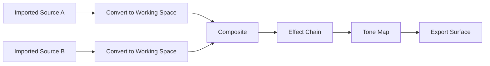

# 203 — Render Graph

**Status:** Proposed  
**Audience:** Rendering and GPU contributors  
**Canonical:** Yes  
**Required context:** `202-frame-compiler.md`, `206-gpu-resource-model.md`  
**Related ADRs:** ADR-0004, ADR-0012, ADR-0013

---

## 1. Purpose

The render graph represents executable GPU work as passes and resources with explicit dependencies and lifetimes.

It converts a frame render plan into a validated execution schedule.

---

## 2. Core Concepts

### 2.1 Pass

A pass declares:

- pass ID;
- pass kind;
- read resources;
- write resources;
- required pipeline;
- parameters;
- debug label;
- diagnostic origin;
- execution constraints.

### 2.2 Logical resource

A graph-local texture or buffer declaration.

### 2.3 Imported resource

An externally owned resource, such as:

- source texture;
- swapchain image;
- encoder input texture;
- persistent cache texture.

### 2.4 Exported resource

A graph result handed to another subsystem or surface owner.

---

## 3. Graph Structure

The graph must be acyclic after expansion of supported feedback constructs.

---

## 4. Pass Kinds

Initial pass categories:

- upload/copy;
- color conversion;
- transform/composite;
- mask;
- blur;
- effect;
- transition;
- scaling;
- tone mapping;
- text/graphics;
- debug overlay;
- export/copy;
- readback only for explicit features.

Pass kind is semantic. Backend may fuse or implement it differently.

---

## 5. Resource Access

Each pass declares access:

- sampled read;
- storage read;
- storage write;
- render attachment write;
- copy source;
- copy destination;
- external acquire;
- external release.

The graph validator rejects conflicting access or unresolved ordering.

---

## 6. Dependency Resolution

Dependencies are derived from:

- explicit pass edges;
- resource read-after-write;
- write-after-read;
- write-after-write;
- external acquire/release constraints.

The scheduler topologically sorts passes while respecting stable ordering for deterministic diagnostics.

---

## 7. Resource Lifetime Analysis

The graph computes first and last use for transient resources.

Resources may alias only when:

- lifetimes do not overlap;
- descriptors are compatible;
- backend permits aliasing;
- debugging mode does not prohibit it;
- safety generation is preserved.

Aliasing is an optimization, not a semantic requirement.

---

## 8. Pass Fusion

The graph may fuse compatible operations when:

- effect semantics are preserved;
- color precision remains valid;
- debug and diagnostic mapping remains available;
- pipeline capability supports it;
- memory benefit or performance is measured.

Fusion must be disabled in diagnostic mode when it prevents useful pass-level inspection.

---

## 9. Compilation Stages

1. import frame plan;
2. expand logical nodes into passes;
3. validate resources;
4. derive dependencies;
5. remove unused passes;
6. compute lifetimes;
7. assign physical resources;
8. select pipelines;
9. plan external synchronization;
10. emit executable graph.

---

## 10. Graph Validation

Validation includes:

- acyclic dependency;
- all reads have producer or valid import;
- one valid ownership path per export;
- resource descriptors compatible;
- no unresolved write conflict;
- no pass references unknown resource;
- external resource generation valid;
- surface format supported;
- memory estimate within policy.

---

## 11. Imported Resources

Imported resources include generation and ownership token.

The graph may not outlive imported resource validity.

If source resource becomes stale before submission, the frame fails or recompiles according to scheduler policy.

---

## 12. Exports

An export declares:

- resource;
- target surface;
- final layout/usage;
- ownership handoff;
- completion signal;
- color metadata;
- alpha semantics.

Encoder and preview exports have different handoff contracts.

---

## 13. Debuggability

The graph should support:

- textual dump;
- Mermaid or DOT export;
- pass timing;
- resource lifetime view;
- physical allocation mapping;
- scene-item origin mapping;
- intermediate capture in explicit diagnostic mode;
- graph validation errors with context.

---

## 14. Memory Budget

Before allocation, the graph estimates:

- transient texture bytes;
- persistent cache use;
- imported resource use;
- export requirements;
- peak overlap.

If budget is exceeded, policy may:

- reduce preview resolution;
- evict caches;
- choose lower precision where allowed;
- reject nonessential surface;
- fail frame with structured diagnostic.

Production semantics must not change silently.

---

## 15. Invariants

1. Graph is acyclic.
2. Every read has a valid producer or import.
3. Resource access is explicit.
4. Transient lifetimes are bounded to graph execution.
5. Imported resources are generation-validated.
6. Exports have explicit ownership handoff.
7. Memory estimate exists before physical allocation.
8. Fusion preserves semantics.
9. Graph execution cannot mutate scene state.
10. Debug origin mapping is retained.

---

## 16. Required Tests

- topological order;
- read-before-write rejection;
- cycle rejection;
- resource aliasing;
- non-overlapping lifetime reuse;
- external resource generation mismatch;
- export handoff;
- pass culling;
- pass fusion equivalence;
- memory budget rejection;
- graph dump fixture;
- multi-surface graph.

---

## 17. AI Implementation Notes

Do not let passes capture arbitrary mutable closures with hidden dependencies.

Represent resource usage explicitly.

Do not allocate physical textures before lifetime analysis.

Keep graph dumps deterministic for testability.
