# 208 — Color Management

**Status:** Proposed  
**Audience:** Rendering, media, output, UI contributors  
**Canonical:** Yes  
**Required context:** `200-rendering-overview.md`, `204-compositor.md`  
**Related ADRs:** ADR-0014

---

## 1. Purpose

Color management ensures that source media, generated graphics, composition, preview, recording, and streaming use explicit and correct color interpretation.

---

## 2. Color Metadata

Every image-like input must resolve:

- primaries;
- transfer function;
- matrix coefficients where relevant;
- range;
- bit depth;
- alpha mode;
- mastering metadata when HDR;
- source format.

Unknown metadata uses a documented fallback and produces diagnostics where ambiguity matters.

---

## 3. Working Space

Mirae uses an explicit linear-light internal working space for composition.

Initial recommended working spaces:

- SDR: linearized Rec.709-compatible working space;
- HDR: linear wide-gamut working space selected by output policy.

The exact numeric representation and gamut are selected in implementation and may require a later accepted ADR, but composition must not occur in unspecified encoded space.

---

## 4. Pipeline

```mermaid
flowchart LR
    Input[Source encoded color]
    Decode[Decode transfer and range]
    Gamut[Convert primaries]
    Linear[Linear working space]
    Composite[Composite and effects]
    OutputGamut[Convert to target primaries]
    ToneMap[Tone map if required]
    Encode[Encode transfer/range]
    Surface[Target surface]

    Input --> Decode --> Gamut --> Linear --> Composite --> OutputGamut --> ToneMap --> Encode --> Surface
```

---

## 5. YUV Sources

YUV sources require explicit:

- matrix;
- range;
- chroma siting;
- subsampling;
- bit depth;
- transfer;
- primaries.

Conversion may occur in shader or platform interop path.

A source is not assumed to be full-range or Rec.709 solely because of resolution.

---

## 6. SDR and HDR

Mirae distinguishes:

- SDR scene/output;
- HDR scene/output;
- mixed SDR/HDR scene;
- SDR preview of HDR production;
- HDR preview of SDR production.

Tone mapping and SDR reference-white handling are explicit policies.

---

## 7. Tone Mapping

Tone mapping is inserted when source and target dynamic range differ.

A tone-map policy declares:

- operator;
- target peak;
- reference white;
- highlight behavior;
- saturation handling;
- metadata source;
- whether adaptive analysis is used.

Adaptive tone mapping must be deterministic for the same frame sequence and must not create unbounded history.

---

## 8. Generated Graphics

Text, shapes, and UI-generated scene graphics declare their color in a known color space.

Hex values from UI are interpreted according to a documented authoring space, not raw linear values.

Conversion to working space occurs before composition.

---

## 9. Alpha and Color

Premultiplied alpha must be applied in a compatible linear color domain.

Color conversion and premultiplication order must avoid dark or bright fringes.

Canonical process for straight-alpha encoded input:

1. decode color;
2. convert to working space;
3. premultiply by alpha;
4. composite.

---

## 10. Preview Accuracy

Preview surfaces may be limited by display and OS capabilities.

The preview subsystem reports:

- target color mode;
- display capability;
- compositor path;
- fallback;
- whether HDR preview is approximate.

Preview approximation does not change program output processing.

---

## 11. Output Metadata

Encoder/output handoff includes:

- pixel format;
- range;
- primaries;
- transfer;
- matrix;
- bit depth;
- mastering metadata when supported;
- content light metadata when supported.

Metadata must match actual pixel processing.

---

## 12. LUTs

LUT support may include:

- 1D;
- 3D;
- technical transform;
- creative look.

LUTs declare:

- input domain;
- output domain;
- interpolation;
- expected range;
- size limits;
- color-space assumptions.

A creative LUT does not replace mandatory technical conversion.

---

## 13. Invariants

1. Color metadata is explicit.
2. Composition occurs in defined linear working space.
3. YUV conversion uses explicit matrix and range.
4. Output metadata matches rendered pixels.
5. Premultiplication is color-domain correct.
6. Preview fallback does not alter production output.
7. Tone mapping policy is explicit.
8. Generated graphics have defined authoring space.
9. LUT domain is declared.
10. Unknown metadata is diagnosable.

---

## 14. Required Tests

- limited/full range;
- Rec.601/709/2020 matrices;
- SDR linear composition;
- HDR source to SDR output;
- SDR source to HDR output;
- premultiplied edge correctness;
- LUT domain;
- output metadata;
- preview fallback;
- golden gradient and color chart fixtures;
- mixed-source scene.

---

## 15. AI Implementation Notes

Do not infer color space from resolution alone.

Do not blend gamma-encoded values.

Do not write output metadata that disagrees with the actual conversion path.

Keep creative looks separate from technical transforms.
