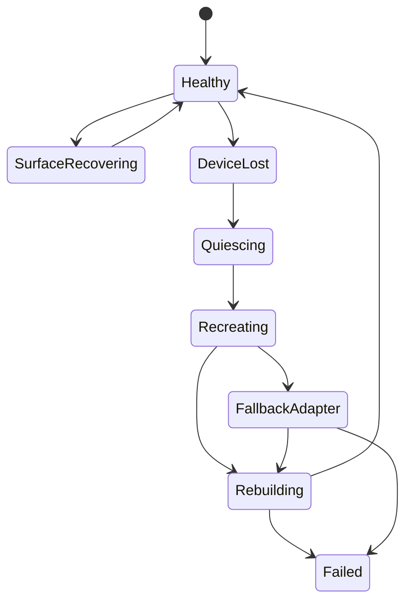

# 212 — Device Loss and Rendering Recovery

**Status:** Proposed  
**Audience:** Rendering, runtime, platform, output contributors  
**Canonical:** Yes  
**Required context:** `205-renderer-backend.md`, `206-gpu-resource-model.md`, `211-preview-and-program-surfaces.md`

---

## 1. Purpose

This document defines recovery when the GPU device, adapter, surface, driver context, or external interop path becomes invalid.

---

## 2. Failure Classes

### 2.1 Surface outdated

Examples:

- resize;
- window recreation;
- present mode change;
- swapchain invalidation.

Recovery is surface-local.

### 2.2 External resource invalid

Examples:

- capture texture generation changed;
- encoder surface invalid;
- shared texture handle revoked.

Recovery is source- or output-local where possible.

### 2.3 Device lost

All device-owned resources become invalid.

Renderer restart is required.

### 2.4 Adapter unavailable

The previous adapter cannot be recreated.

Fallback adapter selection may be attempted.

### 2.5 Driver instability

Repeated device loss or submission failure triggers safe-mode policy or manual intervention.

---

## 3. Recovery State Machine

---

## 4. Device-Loss Procedure

1. stop new graph submission;
2. mark renderer generation invalid;
3. fail or cancel queued frames;
4. notify scheduler and outputs;
5. retain semantic scene and resource descriptors;
6. release or abandon old backend objects;
7. reselect adapter according to policy;
8. create new device generation;
9. rebuild essential pipelines and persistent resources;
10. recreate surfaces;
11. re-establish source/encoder interop;
12. resume preview;
13. resume program/output only when safe and policy permits;
14. publish recovery diagnostics.

---

## 5. Output Behavior

During renderer recovery:

- recording and streaming video frames may drop or pause;
- audio policy is defined by output subsystem;
- encoder session may survive only if interop remains valid;
- automatic stream restart must follow output recovery policy;
- duplicate stream sessions must be prevented;
- user-visible degraded state is mandatory.

---

## 6. Resource Rebuild

Semantic descriptors required for rebuild include:

- shader IDs and versions;
- pipeline descriptors;
- static image asset references;
- text layout/glyph descriptors;
- LUT assets;
- surface descriptors;
- effect configuration;
- source interop descriptors.

Old device handles must never be reused.

---

## 7. Fallback Adapter

Fallback may select:

- same physical adapter through different backend;
- another GPU;
- software adapter for limited preview/recovery;
- no renderer.

Fallback changes are visible in diagnostics.

Production auto-resume on a materially different adapter requires capability validation.

---

## 8. Safe Mode

Repeated renderer failures may start safe mode with:

- reduced preview resolution;
- disabled optional effects;
- no third-party shaders;
- conservative format choices;
- disabled risky interop;
- stronger diagnostics.

Safe mode must not alter saved project intent unless user explicitly saves changes.

---

## 9. Persistence

Renderer recovery does not modify project files.

A crash recovery snapshot may record runtime context, but project semantics remain unchanged.

---

## 10. Invariants

1. Device generation changes after loss.
2. Old resources are never reused.
3. Project state survives renderer failure.
4. Recovery attempts are bounded.
5. Preview recovery is separate from output auto-resume policy.
6. Adapter fallback is diagnosable.
7. Safe mode does not rewrite project intent.
8. Queued stale frames are discarded.
9. External interop is renegotiated.
10. Repeated failure escalates rather than looping forever.

---

## 11. Required Tests

- surface outdated;
- source texture generation change;
- simulated device loss;
- pipeline rebuild;
- resource cache invalidation;
- fallback adapter;
- failed fallback;
- repeated-loss safe mode;
- UI reconnect during recovery;
- output duplicate prevention;
- project state preservation;
- bounded recovery attempts.

---

## 12. AI Implementation Notes

Do not treat device loss as a reason to discard or rewrite the project.

Do not keep old `wgpu` handles after generation change.

Do not automatically resume external streaming without output-policy confirmation.

Use bounded recovery attempts and explicit degraded states.
