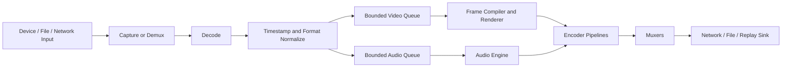

# 300 — Media Overview

**Status:** Proposed  
**Audience:** Media, capture, audio, rendering, output, platform contributors  
**Canonical:** Yes  
**Required context:** `00-foundations/004-system-overview.md`, `01-runtime/103-frame-scheduler.md`, `02-rendering/200-rendering-overview.md`  
**Related ADRs:** ADR-0016, ADR-0017, ADR-0018, ADR-0019, ADR-0020, ADR-0021, ADR-0022

---

## 1. Purpose

The media subsystem acquires, decodes, timestamps, transforms, synchronizes, encodes, records, buffers, and transmits audio and video.

It connects external devices, files, network inputs, the renderer, the audio engine, and output sinks without making any third-party media toolkit part of the Mirae domain model.

---

## 2. Responsibilities

The media subsystem owns:

- source runtime creation;
- device and file capture coordination;
- media decode and demux;
- timestamp normalization;
- canonical audio conversion;
- video frame metadata;
- bounded frame and packet queues;
- source playback control;
- synchronization;
- encoding;
- muxing;
- recording;
- replay buffering;
- streaming transport integration;
- media health and recovery.

---

## 3. Non-Responsibilities

The media subsystem does not own:

- persisted scene semantics;
- UI layout;
- project schema beyond media-specific configuration contracts;
- GPU composition semantics;
- credential storage implementation;
- extension permission decisions;
- platform window ownership.

---

## 4. High-Level Pipeline

---

## 5. Control Plane and Data Plane

### Control plane

Contains:

- source configuration;
- playback commands;
- lifecycle state;
- capabilities;
- health;
- output configuration;
- retry policy;
- diagnostics.

### Data plane

Contains:

- decoded video frames;
- audio blocks;
- encoded packets;
- GPU textures;
- shared memory buffers;
- muxed byte streams.

The generic IPC protocol carries control-plane data only.

---

## 6. Source Classes

Initial source classes include:

- display capture;
- window capture;
- camera;
- microphone;
- system audio;
- media file;
- image;
- browser surface;
- text and generated graphics;
- network stream;
- nested scene;
- extension source.

A source class defines:

- configuration schema;
- runtime capabilities;
- lifecycle;
- media outputs;
- timing behavior;
- fallback behavior;
- diagnostics;
- permission requirements.

---

## 7. Media Processing Principles

1. Timestamps are explicit.
2. Timebases are rational.
3. Queues are bounded.
4. Source availability is separate from project intent.
5. Video and audio lifecycles are independently observable.
6. Media data is immutable after publication.
7. External toolkit types do not cross domain boundaries.
8. Hardware acceleration is optional capability, not hidden assumption.
9. Failure policies are source- or output-local where possible.
10. Every drop, discontinuity, and retry has a reason.

---

## 8. Real-Time Classes

The system distinguishes:

- hard real-time-like callback constraints for audio;
- soft real-time scheduling for video;
- latency-sensitive network paths;
- throughput-oriented recording paths;
- best-effort thumbnails and diagnostics.

One queue policy does not fit every class.

---

## 9. Format Negotiation

Negotiation determines:

- video pixel format;
- dimensions;
- frame rate;
- color metadata;
- memory domain;
- audio sample rate;
- audio channel layout;
- sample format;
- encoder format;
- transport/container compatibility.

Negotiation prefers avoiding copies and conversions while preserving correctness.

---

## 10. Failure Isolation

Examples:

- one camera failure leaves other sources active;
- one encoder failure leaves unrelated outputs active;
- streaming network failure does not stop local recording;
- replay failure does not corrupt the active project;
- audio device failure may degrade monitoring without stopping recording when routing allows it.

---

## 11. Observability

Required media metrics include:

- captured frames and audio blocks;
- decoded frames;
- queue depth;
- dropped units by reason;
- decode latency;
- source timestamp drift;
- audio XRUNs;
- encoder utilization;
- encoded bitrate;
- muxer backlog;
- network send backlog;
- recording write throughput;
- replay retention duration;
- recovery attempts.

---

## 12. Global Invariants

1. Every media unit has defined timing metadata.
2. Every long-lived queue is bounded.
3. Toolkit-native objects remain behind adapters.
4. Source configuration and source runtime are separate.
5. Output pipelines can fail independently.
6. Audio callbacks do not block on disk, network, IPC, or allocation-heavy work.
7. Video frames are not copied to CPU unless required by an explicit path.
8. Discontinuities are explicit.
9. Credentials are referenced indirectly.
10. Media errors are structured and observable.

---

## 13. Required Tests

- file source;
- live source;
- network source;
- source disconnect/reconnect;
- audio-only and video-only source;
- timestamp normalization;
- queue saturation;
- output isolation;
- hardware/software fallback;
- source capability change;
- media discontinuity;
- crash-safe recording fixture;
- replay extraction.

---

## 14. AI Implementation Notes

Do not route raw frames through generic runtime events.

Do not expose FFmpeg packet or frame types outside adapter crates.

Do not use unbounded buffering to hide slow consumers.

Preserve media timestamps and reason-coded drops at every boundary.
