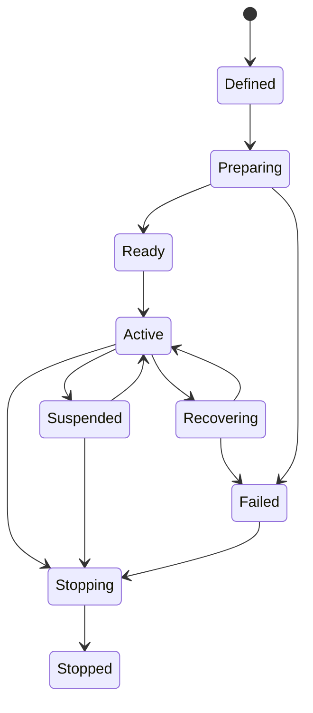

# 301 — Source System

**Status:** Proposed  
**Audience:** Media, scene, project, platform, SDK contributors  
**Canonical:** Yes  
**Required context:** `00-foundations/005-domain-model.md`, `300-media-overview.md`  
**Related ADRs:** ADR-0016

---

## 1. Purpose

The source system maps persisted source definitions to active source runtimes that produce video, audio, metadata, or generated content.

---

## 2. Source Definition Versus Source Runtime

### Source definition

Persisted intent:

- source kind;
- user configuration;
- asset references;
- credential references;
- preferred device identity;
- fallback policy;
- playback defaults;
- permissions metadata;
- extension-owned configuration.

### Source runtime

Session-owned execution:

- device or file handle;
- decoder;
- frame queues;
- audio queues;
- reconnect state;
- runtime capability snapshot;
- health;
- generation;
- worker/process association.

The source definition survives even when runtime creation fails.

---

## 3. Source Registry

The registry maps source kind IDs to factories.

A factory declares:

- source kind ID;
- configuration schema;
- supported media outputs;
- platform support;
- permission requirements;
- capability probe;
- runtime factory;
- migration hooks;
- diagnostics metadata.

Built-in and extension source kinds use separate trust paths.

---

## 4. Runtime Lifecycle

A runtime generation changes when the active underlying resource is replaced.

---

## 5. Source Capabilities

Capabilities may include:

- video;
- audio;
- metadata;
- dynamic resolution;
- dynamic frame rate;
- seeking;
- pausing;
- looping;
- hardware decode;
- zero-copy frames;
- alpha;
- HDR;
- device controls;
- reconnect;
- low-latency mode.

Capabilities are runtime state and may change.

---

## 6. Device Identity

Device-backed sources distinguish:

- stable Mirae device reference;
- platform device identifier;
- human-readable label;
- vendor/product metadata;
- connection path;
- last known capabilities.

Project files should not depend solely on ephemeral enumeration order.

Resolution policy:

1. exact stable identity;
2. platform-specific persistent identifier;
3. user-approved matching fallback;
4. unresolved source.

Automatic substitution must be visible.

---

## 7. Source Sharing

A source definition may be referenced by multiple scene items.

The runtime may share one acquisition session when:

- source semantics allow it;
- timing requirements are compatible;
- one consumer cannot mutate source behavior unexpectedly;
- resource ownership is explicit.

Per-instance effects and transforms remain scene-item concerns.

---

## 8. Activation Policy

Sources may activate:

- when project opens;
- when visible in preview;
- when visible in program;
- when an output starts;
- when explicitly armed;
- always while project active.

Activation policy is explicit and source-kind aware.

Lazy activation must not create an unexpected delay on program transition without prewarm support.

---

## 9. Fallback Behavior

Fallback options:

- transparent;
- last valid frame;
- user-defined placeholder;
- generated offline slate;
- frozen frame with stale indicator;
- source-kind-specific fallback.

Fallback does not rewrite persisted source configuration.

---

## 10. Playback Sources

Playback runtime supports:

- play;
- pause;
- stop;
- seek;
- loop;
- speed where supported;
- end behavior;
- timeline synchronization;
- restart on scene activation policy.

Playback command semantics must define whether state is shared across scene instances.

---

## 11. Extension Sources

Extension source runtime:

- executes in extension host or approved worker;
- exposes media through bounded data-plane contract;
- declares capabilities;
- cannot access unrestricted engine memory;
- has resource quotas;
- reports health;
- can be disabled after repeated failure.

---

## 12. Invariants

1. Source definition survives runtime failure.
2. Runtime generation changes when resource identity changes.
3. Device substitution is visible.
4. Source sharing does not leak per-instance scene behavior.
5. Fallback is explicit.
6. Capabilities are runtime state.
7. Extension sources are isolated.
8. Source queues are bounded.
9. Runtime objects are not persisted.
10. Activation policy is explicit.

---

## 13. Required Tests

- source create/destroy;
- missing device;
- device replacement;
- shared source;
- per-instance transform independence;
- lazy activation;
- prewarm;
- playback end behavior;
- source fallback;
- extension crash;
- capability change;
- runtime generation replacement.

---

## 14. AI Implementation Notes

Do not delete a source definition because the device is unavailable.

Do not key devices by enumeration index.

Do not duplicate capture sessions automatically when multiple scene items reference the same source.

Keep scene-item behavior out of source runtime state.
