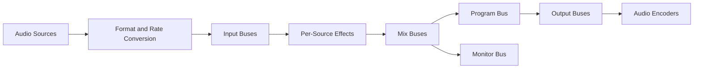

# 306 — Audio Architecture

**Status:** Proposed  
**Audience:** Audio, media, output, platform contributors  
**Canonical:** Yes  
**Required context:** `305-master-clock-and-timebase.md`, `303-media-data-model.md`  
**Related ADRs:** ADR-0018

---

## 1. Purpose

The audio subsystem captures, decodes, converts, mixes, processes, meters, routes, monitors, and delivers audio under real-time constraints.

---

## 2. Canonical Internal Format

The internal mix format is:

- 32-bit floating point;
- planar or interleaved selected consistently by engine implementation;
- explicit channel layout;
- one configured engine mix sample rate;
- normalized range with headroom policy.

Source audio converts to this format before entering the real-time graph.

---

## 3. Audio Graph

---

## 4. Real-Time Thread Rules

The audio callback MUST NOT:

- allocate from general heap;
- block on mutexes with unbounded wait;
- perform filesystem I/O;
- perform network I/O;
- wait on IPC;
- log synchronously;
- enumerate devices;
- compile effects;
- call extension code directly.

Data needed by callback is prepared in advance.

---

## 5. Graph Updates

Audio graph mutations use double-buffered or generation-swapped immutable graph state.

Pattern:

1. build new graph off callback thread;
2. validate;
3. prepare resources;
4. publish pending generation;
5. callback swaps at safe block boundary;
6. retire old graph after no longer in use.

---

## 6. Block Processing

The engine processes bounded blocks.

Block size is chosen based on:

- device callback;
- latency target;
- effect constraints;
- encoder frame size;
- resampler behavior.

Adapters bridge differing block sizes without unbounded buffering.

---

## 7. Resampling

Resampling handles:

- source sample-rate mismatch;
- device clock drift;
- encoder rate requirements;
- playback speed where supported.

Resampler state is source- or route-specific and resets on discontinuity.

---

## 8. Channel Layout

Channel layouts are semantic, not just channel counts.

Examples:

- mono;
- stereo;
- 5.1;
- 7.1;
- custom named layouts.

Mix matrices are explicit.

Automatic downmix/upmix policies are documented and diagnosable.

---

## 9. Effects

Audio effects declare:

- channel layout compatibility;
- latency;
- tail duration;
- real-time safety;
- parameter update mode;
- state reset;
- bypass behavior;
- resource limits.

Effects with unbounded latency or allocation are not allowed on real-time buses.

---

## 10. Metering

Meters may include:

- peak;
- RMS;
- loudness;
- clipping;
- true peak where supported.

Meter extraction is lock-free or bounded and rate-limited before UI delivery.

---

## 11. Silence and Gaps

Missing source audio policy:

- silence insertion;
- last-sample hold only where explicitly valid;
- source mute;
- discontinuity reset.

Silence is generated with correct timing to preserve output continuity.

---

## 12. Device Changes

Audio device changes may require:

- stream restart;
- sample-rate renegotiation;
- channel layout change;
- callback size change;
- monitor route update.

Program audio encoding should continue when monitor device fails if architecture permits.

---

## 13. Invariants

1. Real-time callback performs bounded work.
2. Canonical mix format is explicit.
3. Graph updates swap at block boundaries.
4. Channel layouts are semantic.
5. Resampler state resets on discontinuity.
6. Missing audio produces timed silence when continuity requires it.
7. UI meters do not drive audio graph.
8. Device failure is isolated where possible.
9. Effects declare latency.
10. Extension code does not run directly in callback.

---

## 14. Required Tests

- format conversion;
- sample-rate conversion;
- drift correction;
- graph swap;
- source mute;
- device loss;
- monitor-only failure;
- channel downmix;
- effect latency;
- meter extraction;
- silence insertion;
- callback allocation audit;
- XRUN simulation.

---

## 15. AI Implementation Notes

Do not use async runtime primitives inside the audio callback.

Do not mutate the active graph in place from the control thread.

Do not represent channels only as an integer count.

Preallocate and prepare everything required by the callback.
