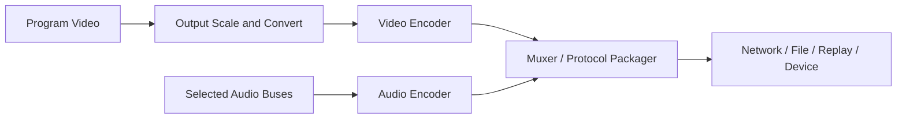
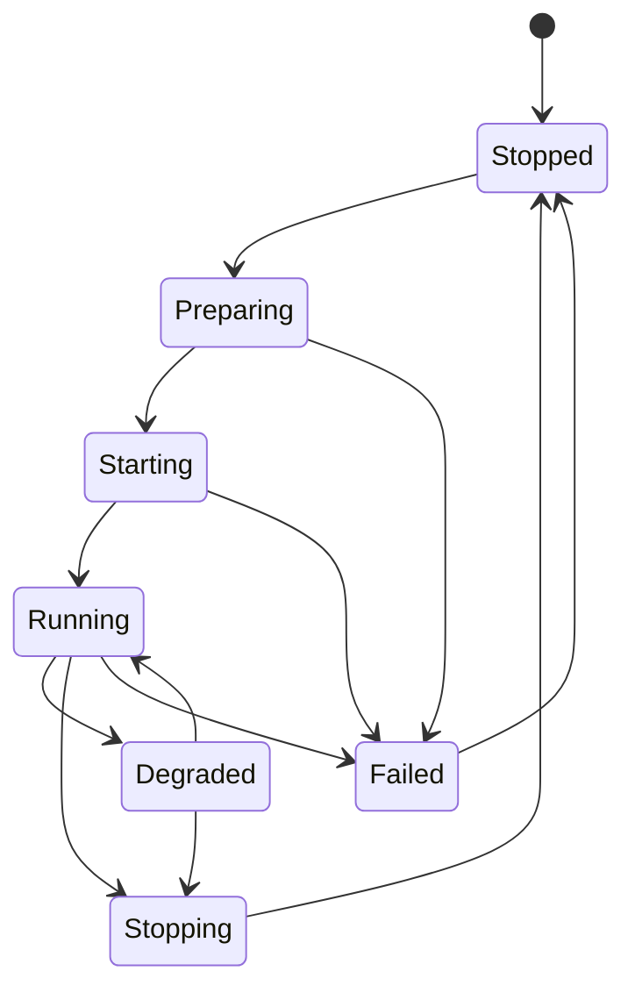

# 310 — Output Architecture

**Status:** Proposed  
**Audience:** Output, media, recording, streaming contributors  
**Canonical:** Yes  
**Required context:** `309-encoder-system.md`, `01-runtime/103-frame-scheduler.md`  
**Related ADRs:** ADR-0019, ADR-0020

---

## 1. Purpose

The output architecture creates independent pipelines for streaming, recording, replay, virtual devices, and future sinks.

---

## 2. Output Profile Versus Output Runtime

### Output profile

Persisted intent:

- output kind;
- video settings;
- audio track mapping;
- encoder preferences;
- destination reference;
- retry policy;
- recording naming policy;
- segmentation policy;
- credential reference.

### Output runtime

Session execution:

- lifecycle state;
- encoder sessions;
- muxer;
- sink;
- queues;
- metrics;
- retries;
- runtime generation;
- failure state.

---

## 3. Output Pipeline

---

## 4. Output Types

Initial output categories:

- live stream;
- local recording;
- replay buffer;
- virtual camera;
- virtual microphone or audio sink where supported;
- preview/program display;
- screenshot/export;
- extension output.

---

## 5. Lifecycle

Output generation changes on full pipeline recreation.

---

## 6. Preparation

Preparation validates:

- destination;
- credentials;
- encoder availability;
- surface compatibility;
- container/protocol compatibility;
- disk space or network configuration;
- audio track mapping;
- policy limits.

Preparation should avoid external side effects where possible.

---

## 7. Start Commit Point

The output start command must define when it is considered committed.

Examples:

- recording: file created and headers initialized;
- streaming: transport connected and publisher accepted;
- replay: encoder and retention store active;
- virtual camera: device endpoint active.

A command acknowledgement does not claim `Running` before the output reaches its defined start point.

---

## 8. Independent Failure

Each output owns its:

- encoders;
- muxer;
- sink;
- retries;
- diagnostics;
- queue policy.

Shared resources may be used only through leases and must not create coupled shutdown.

---

## 9. Shared Encoding

Two outputs may share encoded streams only when all relevant settings match:

- codec;
- resolution;
- frame rate;
- color;
- rate control;
- keyframe policy;
- audio tracks;
- latency constraints;
- packet ownership.

Shared encoding is an optimization and must not make failure or restart ambiguous.

---

## 10. Output Backpressure

Each output reports backpressure source:

- render surface;
- encoder;
- muxer;
- network;
- disk;
- device consumer.

Policy may drop, backpressure, degrade, reconnect, segment, or stop.

---

## 11. Diagnostics

Output health includes:

- state;
- generation;
- uptime;
- encoded frames;
- dropped frames by reason;
- bitrate;
- queue depths;
- encoder utilization;
- muxer backlog;
- sink latency;
- retry count;
- last error;
- current segment;
- discontinuity count.

---

## 12. Invariants

1. Output profile and runtime are separate.
2. Outputs fail independently.
3. Each queue is bounded.
4. Start commit point is defined.
5. Shared encoding preserves independent lifecycle.
6. Credentials are indirect.
7. Output generation changes on recreation.
8. Backpressure source is observable.
9. Stop and flush policy are explicit.
10. Output failure does not mutate project intent silently.

---

## 13. Required Tests

- start/stop;
- preparation failure;
- credential unavailable;
- encoder failure;
- sink failure;
- output independence;
- shared encoder compatibility;
- backpressure;
- generation restart;
- stop timeout;
- UI reconnect with active output;
- output diagnostics.

---

## 14. AI Implementation Notes

Do not use one global encoder for all outputs unless compatibility is proven.

Do not mark an output running merely because preparation started.

Do not store live sink handles in project state.

Keep retry policy output-specific.
