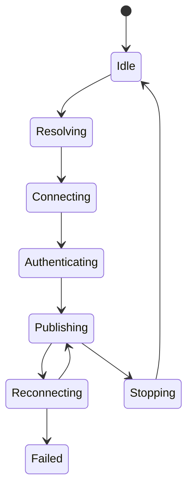

# 311 — Streaming and Network Reliability

**Status:** Proposed  
**Audience:** Network, output, security, media contributors  
**Canonical:** Yes  
**Required context:** `310-output-architecture.md`, `305-master-clock-and-timebase.md`  
**Related ADRs:** ADR-0019, ADR-0020

---

## 1. Purpose

This document defines reliable live network output behavior, connection lifecycle, retries, buffering, authentication, congestion, and diagnostics.

---

## 2. Supported Protocol Model

Protocols are implemented behind transport/output adapters.

Possible protocols include:

- RTMP/RTMPS;
- SRT;
- RIST;
- RTP;
- WebRTC;
- future service-specific APIs.

Adding a protocol does not change the output domain model unless the protocol introduces a genuinely new capability.

---

## 3. Connection Lifecycle

Not every protocol uses all states, but diagnostics map to this common model.

---

## 4. DNS and Connection

Network setup must define:

- DNS timeout;
- address ordering;
- IPv4/IPv6 behavior;
- connection timeout;
- proxy behavior;
- TLS validation;
- certificate errors;
- cancellation.

Certificate validation is never disabled silently.

---

## 5. Authentication

Credentials come from secure storage through credential references.

Logs and diagnostics redact:

- stream keys;
- access tokens;
- authorization headers;
- signed URLs;
- cookies;
- private endpoint query secrets.

---

## 6. Reconnect Policy

Reconnect policy includes:

- enabled;
- maximum attempts;
- total retry window;
- initial delay;
- maximum delay;
- jitter;
- reset conditions;
- whether encoder continues;
- whether new keyframe is requested;
- whether timestamps continue or restart;
- when user action is required.

Retries are bounded.

---

## 7. Buffering

Network buffering has explicit limits in:

- bytes;
- packets;
- media duration.

When exceeded, policy may:

- drop non-key video packets where protocol allows;
- request keyframe;
- reduce bitrate if adaptive policy is enabled;
- disconnect/reconnect;
- fail output.

The system must not buffer minutes of live stream invisibly.

---

## 8. Congestion and Adaptive Behavior

Adaptive bitrate or quality is optional and explicit.

An adaptive policy declares:

- metrics observed;
- minimum/maximum bitrate;
- update interval;
- hysteresis;
- encoder reconfiguration ability;
- fallback when encoder cannot reconfigure;
- user visibility.

No hidden adaptive behavior changes production quality by default.

---

## 9. Timestamp Continuity

On reconnect, protocol adapter defines:

- continuous timestamp;
- timestamp reset;
- new publishing session;
- discontinuity signaling;
- keyframe requirement.

This behavior must match service and muxer expectations.

---

## 10. Keepalive and Liveness

Protocols may use:

- ping/pong;
- socket keepalive;
- application acknowledgements;
- packet feedback;
- publication heartbeat.

Liveness timeouts are explicit and not confused with low traffic.

---

## 11. Multi-Destination Streaming

Each destination is an independent output runtime unless a dedicated relay architecture is introduced.

One destination failure does not stop others.

Shared encoding may be used only when settings are compatible.

---

## 12. Security

Requirements:

- TLS by default where protocol supports it;
- certificate validation;
- credential redaction;
- endpoint validation;
- bounded parser inputs;
- protocol state-machine validation;
- no arbitrary shell invocation;
- safe handling of untrusted server messages.

---

## 13. Diagnostics

Required metrics:

- DNS time;
- connection time;
- handshake time;
- publish time;
- bytes sent;
- current and average bitrate;
- send queue depth;
- RTT where available;
- retransmissions/loss where available;
- reconnect count;
- last protocol error;
- auth failure category;
- TLS details safe for display.

---

## 14. Invariants

1. Reconnect attempts are bounded.
2. Credentials never enter logs.
3. Network buffers are bounded.
4. TLS validation is not silently disabled.
5. Each destination fails independently.
6. Timestamp behavior on reconnect is explicit.
7. Adaptive quality is explicit.
8. Protocol parsers are bounded.
9. User cancellation stops connection attempts.
10. Network failure does not stop unrelated recording.

---

## 15. Required Tests

- DNS failure;
- connection timeout;
- TLS failure;
- auth failure;
- disconnect/reconnect;
- buffer saturation;
- cancellation;
- multi-destination isolation;
- timestamp reconnect policy;
- credential redaction;
- malformed server response;
- adaptive bitrate hysteresis.

---

## 16. AI Implementation Notes

Do not implement retries with infinite loops.

Do not log endpoint URLs before removing secrets.

Do not disable TLS checks for convenience.

Keep protocol state machines explicit and fuzzable.
