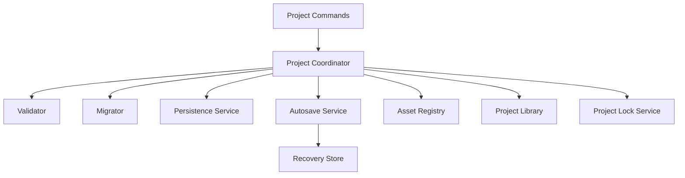
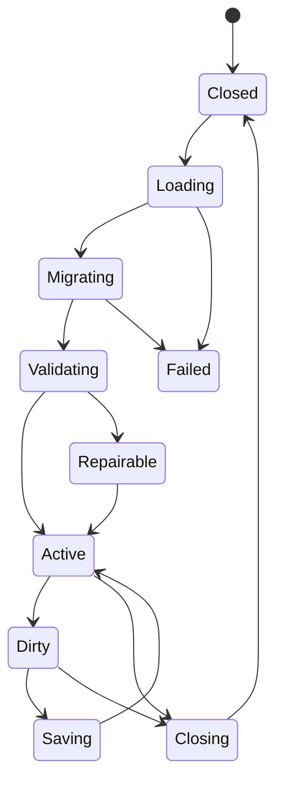

# 400 — Project Overview

**Status:** Proposed  
**Audience:** Project, persistence, runtime, UI, SDK contributors  
**Canonical:** Yes  
**Required context:** `00-foundations/005-domain-model.md`, `01-runtime/106-state-store.md`, `01-runtime/107-transactions.md`  
**Related ADRs:** ADR-0003, ADR-0023, ADR-0024, ADR-0025, ADR-0026, ADR-0027, ADR-0028, ADR-0029, ADR-0030

---

## 1. Purpose

The project subsystem stores the user's production intent in a local, portable, versioned, recoverable representation.

It owns project creation, open, save, autosave, recovery, validation, migration, assets, portability, and project-library indexing.

---

## 2. Core Properties

A Mirae project MUST be:

- local-first;
- readable without a Mirae cloud account;
- versioned;
- platform-independent at the semantic level;
- recoverable after interrupted writes;
- explicit about external dependencies;
- free of live runtime handles;
- free of embedded plaintext credentials;
- migratable;
- diagnosable when partially damaged.

---

## 3. Persisted Versus Runtime State

Persisted project state includes:

- project metadata;
- scenes;
- source definitions;
- scene items;
- output profiles;
- audio routing intent;
- asset records;
- effect and transition configuration;
- extension-owned project configuration;
- user-defined automation configuration where supported;
- schema and feature metadata.

Runtime state excludes:

- GPU resources;
- process IDs;
- active sockets;
- capture sessions;
- decoders and encoders;
- current queue depths;
- live metrics;
- engine session ID;
- device handles;
- active transition progress;
- temporary UI state.

---

## 4. Project Services

---

## 5. Project Lifecycle

A project remains active in memory while an ordinary save occurs.

---

## 6. Project Identity

A project has:

- stable project ID;
- schema version;
- human-readable name;
- creation timestamp;
- last explicit save timestamp;
- optional origin metadata;
- optional bundle identity;
- project feature flags.

Project identity is independent from file path.

Copying a project may preserve or regenerate identity depending on the command:

- `DuplicateProject` generates a new project ID;
- backup copy preserves identity;
- export bundle preserves identity unless explicitly cloned.

---

## 7. Dirty State

Dirty state is based on committed project-domain generations.

It distinguishes:

- clean against last explicit save;
- autosaved but not explicitly saved;
- migration pending save;
- external file changed;
- recovery state exists;
- save failed.

The UI must not equate “autosaved” with “explicitly saved.”

---

## 8. Open Semantics

Project open stages:

1. acquire read or write lock;
2. read project envelope;
3. validate integrity metadata;
4. parse schema;
5. migrate in memory;
6. validate domain semantics;
7. resolve asset references;
8. construct authoritative state;
9. initialize runtime services;
10. commit project activation.

The previous project remains active until activation commits.

---

## 9. Save Semantics

Save:

- obtains immutable project-domain snapshot;
- validates serializable state;
- serializes current schema;
- writes to temporary location;
- flushes required data;
- atomically publishes;
- updates library metadata;
- records saved generation;
- prunes recovery state according to policy.

External assets are not copied during ordinary save unless they are managed project assets.

---

## 10. Failure Philosophy

A project should open as far as safely possible.

Examples:

- missing asset → unresolved asset diagnostic;
- missing device → source unavailable;
- missing credential → output unavailable;
- missing extension → preserve opaque extension config if schema permits;
- corrupt optional cache → rebuild;
- invalid critical schema → repair mode or reject.

Mirae must not silently delete unsupported or unresolved user intent.

---

## 11. Global Invariants

1. One stable project ID exists independently from path.
2. Runtime handles never serialize.
3. Credentials are indirect.
4. Save publication is atomic.
5. Autosave is separate from explicit save.
6. Migrations are deterministic.
7. Project activation is atomic at engine level.
8. Missing external resources do not silently alter intent.
9. One writer owns a project at a time.
10. Project files remain understandable without cloud state.

---

## 12. Required Tests

- create/open/save;
- duplicate identity;
- missing asset;
- missing credential;
- missing extension;
- explicit save failure;
- autosave recovery;
- interrupted write;
- external modification;
- migration;
- lock conflict;
- repair mode;
- bundle export/import.

---

## 13. AI Implementation Notes

Do not store runtime state because it is convenient for reopening.

Do not overwrite the current active project until the new project validates and activates.

Do not treat autosave as a replacement for explicit save semantics.

Preserve unresolved user intent whenever it can be represented safely.
