# 403 — Persistence

**Status:** Proposed  
**Audience:** Project, runtime, platform contributors  
**Canonical:** Yes  
**Required context:** `401-project-format.md`, `01-runtime/106-state-store.md`, `01-runtime/107-transactions.md`  
**Related ADRs:** ADR-0024

---

## 1. Purpose

The persistence service converts immutable project-domain snapshots into durable project files and publishes them atomically.

---

## 2. Save Inputs

A save request includes:

- project ID;
- source state generation;
- project schema version;
- immutable serializable snapshot;
- destination;
- save reason;
- expected file identity/version;
- correlation ID.

The persistence service never reads mutable state during serialization.

---

## 3. Save Pipeline

```mermaid
flowchart LR
    Snapshot[Immutable Project Snapshot]
    Validate[Serialization Validation]
    Serialize[Canonical Serialization]
    Temp[Write Temporary File]
    Flush[Flush Data]
    Verify[Optional Read-Back/Hash Verify]
    Publish[Atomic Replace/Rename]
    Directory[Directory Durability Step]
    Commit[Report Saved Generation]

    Snapshot --> Validate --> Serialize --> Temp --> Flush --> Verify --> Publish --> Directory --> Commit
```

---

## 4. Atomic Publication

The visible project path must resolve to:

- complete previous version; or
- complete new version.

It must never expose a partially written replacement.

Platform adapters implement the strongest safe replace operation available.

---

## 5. Temporary Files

Temporary save files:

- live in the same filesystem when atomic rename requires it;
- use collision-resistant names;
- include safe ownership metadata;
- are excluded from project-library discovery;
- are cleaned after bounded retention;
- are never mistaken for recovery snapshots.

---

## 6. Durability Levels

Save policy may define:

- `Fast`: process-visible durability;
- `Normal`: file data flushed according to platform guarantees;
- `Strong`: file and directory metadata flushed where supported.

Explicit user save should use at least `Normal`.

Autosave may use a separate optimized policy while preserving recoverability.

---

## 7. External Modification

Before replacing an existing project, compare known file identity:

- modification generation;
- file metadata;
- content hash when available;
- expected save token.

On conflict:

- reject overwrite;
- offer save copy;
- allow explicit force after user confirmation;
- preserve external version.

---

## 8. Save Coalescing

Multiple save requests may be coalesced.

Rules:

- explicit save acknowledgement corresponds to a generation at least as new as requested;
- older pending snapshots may be skipped;
- one writer pipeline owns destination;
- failure state is not hidden by a later background save.

---

## 9. Serialization Isolation

Large serialization may run outside control thread.

The snapshot is immutable.

Serialization failure:

- does not affect active project state;
- reports structured field/path context;
- does not publish temporary file.

---

## 10. Backups

Optional rotating backups may retain previous explicit saves.

Policy declares:

- count;
- age;
- storage location;
- size bound;
- cleanup;
- privacy;
- whether assets are included.

Backups do not replace autosave/recovery.

---

## 11. Save Result

Result includes:

- project ID;
- saved state generation;
- final path;
- file identity token;
- bytes written;
- duration;
- durability level;
- hash;
- backup result;
- warning diagnostics.

---

## 12. Invariants

1. Save input is immutable.
2. Publication is atomic.
3. Temporary files are not canonical.
4. External modification is detected.
5. Explicit save acknowledgement names saved generation.
6. Serialization does not hold authoritative state locks.
7. Failure preserves previous project file.
8. Secrets are excluded before serialization.
9. Backups are bounded.
10. Platform-specific durability is explicit.

---

## 13. Required Tests

- normal save;
- crash during temp write;
- crash before rename;
- crash after rename;
- external modification;
- save coalescing;
- disk full;
- permission denied;
- deterministic serialization;
- backup rotation;
- stale temporary cleanup;
- strong durability adapter.

---

## 14. AI Implementation Notes

Do not write in place over the canonical file.

Do not serialize while holding the state-store commit lock.

Do not overwrite an externally modified project silently.

Return the exact saved generation.
