# 408 — Schema Versioning and Migrations

**Status:** Proposed  
**Audience:** Project, migration, SDK contributors  
**Canonical:** Yes  
**Required context:** `401-project-format.md`, `404-autosave-and-recovery.md`  
**Related ADRs:** ADR-0028

---

## 1. Purpose

This document defines project schema compatibility, deterministic migration, downgrade behavior, and migration testing.

---

## 2. Version Model

The project envelope contains an integer schema version.

Rules:

- each semantic schema change increments version;
- migrations are ordered;
- one version represents one defined schema;
- app version and schema version are separate;
- optional feature flags do not replace schema version.

---

## 3. Migration Direction

Canonical migrations move forward:

```text
v1 → v2 → v3 → current
```

Direct shortcut migrations may exist for performance but must produce equivalent current state.

Automatic downgrade is not guaranteed.

---

## 4. Migration Contract

A migration:

- accepts one exact source schema version;
- validates input bounds;
- produces one exact target schema version;
- is deterministic;
- has no network dependency;
- does not access credentials;
- does not mutate original file;
- emits structured warnings;
- has fixture tests.

---

## 5. Migration Pipeline

```mermaid
flowchart LR
    Read[Read Original]
    Validate[Validate Source Schema]
    Backup[Preserve Original / Checkpoint]
    Migrate[Apply Ordered Migrations]
    Domain[Build Domain Model]
    Verify[Validate Current Semantics]
    Activate[Activate In Memory]
    Save[Explicitly Save Current Schema Later]

    Read --> Validate --> Backup --> Migrate --> Domain --> Verify --> Activate
    Activate -. user save .-> Save
```



Opening a project may migrate in memory without immediately overwriting the original file.

---

## 6. Unknown Newer Schema

When schema version is newer than supported:

- do not attempt blind parse;
- inspect envelope safely;
- report required app version/features;
- offer read-only metadata where safe;
- preserve file unchanged;
- allow opening in newer Mirae version.

---

## 7. Migration Warnings

Warnings may include:

- deprecated effect replaced;
- unsupported extension preserved but unavailable;
- path representation changed;
- color interpretation updated;
- removed invalid field;
- fallback default applied.

Warnings are persisted in migration report, not necessarily in project schema.

---

## 8. Irreversible Changes

An irreversible migration requires:

- ADR;
- explicit backup;
- UI warning when user save would make downgrade impossible;
- compatibility note;
- tests with older app behavior where practical.

---

## 9. Extension Migrations

Extension-owned data migrations are declared by extension version/schema.

If extension is unavailable:

- preserve opaque bounded data when safe;
- mark feature unavailable;
- do not invent migration;
- allow project open if extension data is optional.

Core migrations must not execute arbitrary extension code in the engine process.

---

## 10. Autosave Compatibility

Recovery records identify schema version.

Recovery open:

- validates base project;
- migrates recovery snapshot/deltas in isolation;
- preserves original recovery data until success;
- reports migration warnings.

---

## 11. Test Corpus

Maintain fixtures for:

- every historical schema;
- boundary values;
- missing optional fields;
- unknown extension data;
- corrupt fields;
- migration warnings;
- large projects;
- real-world anonymized projects where permitted.

---

## 12. Invariants

1. Schema version is explicit.
2. Migrations are deterministic.
3. Original file is preserved until explicit save.
4. Newer unsupported schemas are not blindly parsed.
5. Every migration has fixtures.
6. App version is not schema version.
7. Extension code does not execute during core migration.
8. Irreversible change is explicit.
9. Recovery data is migrated safely.
10. Migration warnings are retained for user review.

---

## 13. Required Tests

- each version to current;
- direct versus sequential equivalence;
- unsupported newer version;
- corrupt old project;
- irreversible warning;
- extension absent;
- autosave migration;
- deterministic repeated migration;
- large-project performance;
- original preservation;
- migration report.

---

## 14. AI Implementation Notes

Do not mutate the source project file during migration.

Do not use application version comparisons as schema migration logic.

Do not run arbitrary extension code inside the core migrator.

Add a fixture for every new migration.
