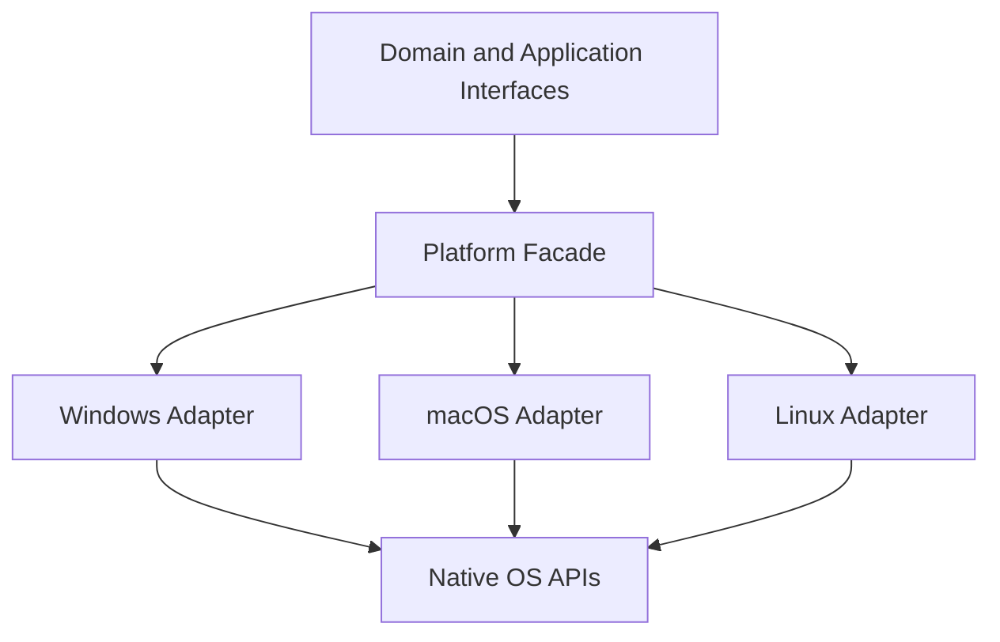

# 500 — Platform Overview

**Status:** Proposed  
**Audience:** Platform, runtime, rendering, media, shell contributors  
**Canonical:** Yes  
**Required context:** `00-foundations/002-product-and-system-boundaries.md`, `00-foundations/004-system-overview.md`, `01-runtime/101-process-model.md`  
**Related ADRs:** ADR-0031, ADR-0032, ADR-0033, ADR-0034, ADR-0035, ADR-0036, ADR-0037, ADR-0038

---

## 1. Purpose

The platform layer integrates Mirae with Windows, macOS, and Linux while preserving one stable cross-platform domain architecture.

Platform code owns operating-system-specific implementation. It does not redefine project semantics.

---

## 2. Responsibilities

The platform layer owns:

- native window creation and lifecycle;
- display enumeration and changes;
- native capture APIs;
- camera and audio-device integration;
- GPU and hardware-encoder interop;
- permissions and entitlements;
- secure credential storage;
- notifications;
- file associations and deep links;
- power, suspend, resume, and session changes;
- packaging, signing, installation, and updates;
- platform capability discovery;
- compatibility workarounds;
- native diagnostics.

---

## 3. Non-Responsibilities

The platform layer does not own:

- scene graph semantics;
- project schema;
- command validation;
- output-profile semantics;
- UI navigation;
- cross-platform source definitions;
- extension permission policy;
- media clock rules.

It implements interfaces defined by inward-facing domain and application layers.

---

## 4. Dependency Direction

Domain crates do not import operating-system SDK types.

---

## 5. Platform Interface Families

- shell;
- windowing;
- display;
- capture;
- audio devices;
- cameras;
- hardware encoders;
- graphics interop;
- permissions;
- credentials;
- filesystem;
- notifications;
- deep links;
- updater;
- code signing;
- power/session;
- diagnostics.

Interfaces should model Mirae concepts rather than mirroring entire OS APIs.

---

## 6. Capability-Driven Behavior

Mirae does not infer support solely from operating-system name.

Capabilities consider:

- OS version;
- build;
- desktop/session type;
- GPU adapter;
- driver;
- hardware encoder;
- permissions;
- packaging mode;
- sandbox/entitlements;
- API availability;
- known workarounds.

Feature availability is represented through a generation-stamped capability snapshot.

---

## 7. Native and Portable Layers

Portable code owns:

- domain semantics;
- state;
- command/event contracts;
- scheduler;
- scene/media/output architecture;
- project format;
- diagnostics model.

Native code owns:

- actual OS handles;
- callback registration;
- FFI;
- permissions;
- API negotiation;
- device identity;
- external-memory interop;
- package/update integration.

---

## 8. Unsafe Code Policy

Unsafe code is expected around:

- FFI;
- COM;
- Objective-C/Swift interop;
- C libraries;
- native handles;
- shared memory;
- GPU interop.

Requirements:

- narrow modules;
- documented safety invariants;
- no panic across FFI;
- ownership wrappers;
- generation tracking;
- tests or probes;
- review by platform owner.

---

## 9. Platform Feature Status

Each feature reports:

- `Supported`;
- `SupportedWithLimitations`;
- `Experimental`;
- `Unavailable`;
- `PermissionRequired`;
- `BlockedByPackaging`;
- `BlockedByDriver`;
- `BlockedBySession`;
- `Unknown`.

A boolean is insufficient for diagnosable capability.

---

## 10. Global Invariants

1. Domain crates do not depend on OS SDK types.
2. Platform behavior is capability-driven.
3. Native handles are wrapped and generation-tracked.
4. Unsafe code is isolated.
5. Permissions are explicit.
6. Credentials use OS secure stores.
7. Platform failures do not silently rewrite project intent.
8. Packaging mode is observable.
9. Workarounds are centralized.
10. Platform diagnostics use stable reason codes.

---

## 11. Required Tests

- adapter selection;
- missing API;
- unsupported OS version;
- permission denied;
- display hotplug;
- device hotplug;
- suspend/resume;
- package capability difference;
- credential-store unavailable;
- update signature failure;
- workaround activation;
- native-handle generation invalidation.

---

## 12. AI Implementation Notes

Do not place `cfg(target_os)` branches throughout domain crates.

Do not expose raw native handles across stable interfaces.

Do not assume a feature exists because the OS family normally supports it.

Add capabilities and structured limitations instead of hidden fallbacks.
