# 509 — Updates, Packaging, and Signing

**Status:** Proposed  
**Audience:** Release, platform, security, shell contributors  
**Canonical:** Yes  
**Required context:** `01-runtime/101-process-model.md`, `500-platform-overview.md`  
**Related ADRs:** ADR-0034

---

## 1. Purpose

This document defines secure distribution, installation, update staging, signature verification, rollback, and release-channel behavior.

---

## 2. Package Properties

Every official package declares:

- platform;
- architecture;
- build ID;
- version;
- release channel;
- packaging mode;
- included components;
- minimum OS;
- signature identity;
- manifest hash;
- dependency notices.

---

## 3. Release Channels

Initial channels:

- stable;
- beta;
- nightly/development.

Channel switching is explicit.

A project format or SDK change must follow compatibility policy independently from release channel.

---

## 4. Update Architecture

```mermaid
flowchart LR
    Check[Fetch Signed Update Metadata]
    Select[Select Compatible Package]
    Download[Download to Staging]
    Verify[Verify Hash and Signature]
    Prepare[Prepare Replacement]
    Drain[Stop Mirae Processes]
    Install[Atomic/Staged Install]
    Validate[Launch and Validate]
    Rollback[Rollback if Required]

    Check --> Select --> Download --> Verify --> Prepare --> Drain --> Install --> Validate
    Validate --> Rollback
```

---

## 5. Signed Metadata

Update metadata includes:

- version;
- channel;
- platform/architecture;
- package URL or locator;
- size;
- hash;
- signature;
- minimum updater version;
- rollout constraints;
- revocation data;
- release notes reference.

The updater does not trust transport security alone.

---

## 6. Staging

Downloads go to isolated staging.

Requirements:

- bounded size;
- partial-download handling;
- resume where safe;
- no execution before verification;
- permission-restricted storage;
- cleanup;
- disk-space checks.

---

## 7. Installation

The updater:

- verifies no unsafe active process replacement;
- coordinates engine/shell shutdown;
- preserves user projects and settings;
- records previous version;
- replaces files through platform-safe mechanism;
- verifies installed result;
- starts new version only after validation.

---

## 8. Rollback

Rollback triggers may include:

- launch failure;
- signature mismatch after install;
- health-check failure;
- incompatible data migration warning;
- explicit user action where supported.

Project files are not automatically downgraded.

---

## 9. Code Signing

All release executables, helpers, libraries, and installers are signed according to platform requirements.

Nested helpers must match the release identity.

Unsigned or incorrectly signed components fail verification.

---

## 10. Extension and Resource Integrity

Bundled UI resources, shaders, schemas, and helper binaries may be covered by a release manifest.

Integrity failure enters safe failure mode rather than loading modified critical resources.

---

## 11. Offline Installation

Users may install signed offline packages.

The installer verifies embedded signatures and manifests without contacting Mirae services when possible.

---

## 12. Update Privacy

Update checks send minimal data:

- channel;
- current version;
- platform;
- architecture;
- packaging mode;
- anonymous rollout cohort if used.

Project names, hardware serials, and credentials are excluded.

---

## 13. Invariants

1. Packages and metadata are signed.
2. Downloads are verified before execution.
3. Update replacement occurs only after process shutdown.
4. User data is outside installation replacement.
5. Rollback metadata exists.
6. Project schema is not automatically downgraded.
7. Packaging mode is explicit.
8. Helpers share signing identity.
9. Staging is bounded and permission-restricted.
10. Update checks minimize data.

---

## 14. Required Tests

- valid update;
- metadata signature failure;
- package hash failure;
- interrupted download;
- insufficient disk;
- active process;
- failed launch rollback;
- helper signature mismatch;
- offline installer;
- channel switch;
- staging cleanup;
- privacy payload snapshot.

---

## 15. AI Implementation Notes

Do not execute or unpack unverified update code into the live installation.

Do not replace running binaries directly.

Do not couple project migration rollback to binary rollback without explicit compatibility design.

Keep update metadata signed independently from TLS.
