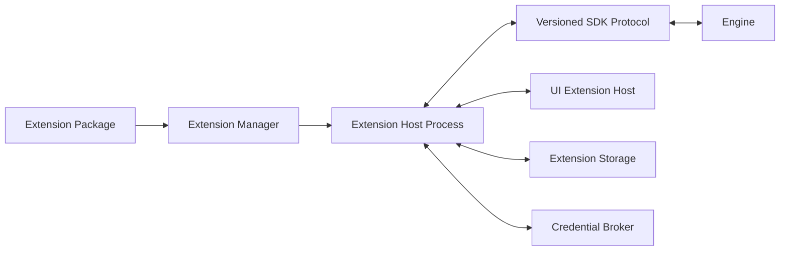

# 700 — SDK Overview

**Status:** Proposed  
**Audience:** SDK, runtime, extension, UI, media, security contributors  
**Canonical:** Yes  
**Required context:** `01-runtime/101-process-model.md`, `06-quality/612-security-model.md`, `06-quality/615-compatibility-policy.md`  
**Related ADRs:** ADR-0047, ADR-0048, ADR-0049, ADR-0050, ADR-0051, ADR-0052, ADR-0053, ADR-0054

---

## 1. Purpose

The Mirae SDK allows third parties and first-party optional modules to extend the application without gaining unrestricted access to engine memory, project files, devices, credentials, or native operating-system APIs.

The SDK is capability-based, versioned, typed, isolated, observable, and bounded.

---

## 2. Extension Goals

The extension system MUST support:

- new source kinds;
- new output destinations;
- safe effects and transforms;
- automation and control integrations;
- service integrations;
- project metadata namespaces;
- constrained UI contributions;
- custom import/export workflows;
- diagnostics and development tooling;
- optional future remote-control clients.

---

## 3. Non-Goals

The SDK MUST NOT:

- expose unrestricted engine pointers;
- provide a stable C/C++ ABI into the engine;
- allow arbitrary native code in the engine process;
- allow extensions to read all project data by default;
- allow direct credential reads without explicit policy;
- allow unrestricted filesystem, network, process, or device access;
- allow extension UI to inject arbitrary code into the control UI origin;
- allow unbounded CPU, memory, queue, log, or storage use.

---

## 4. Extension Tiers

### 4.1 Built-in module

Shipped and signed with Mirae.

It may use internal APIs, but must still respect subsystem boundaries.

### 4.2 Trusted first-party extension

Distributed separately but signed by Mirae.

It uses the public SDK unless an explicit internal API contract exists.

### 4.3 Third-party extension

Runs through the extension host and public SDK.

It receives only approved capabilities.

### 4.4 Development extension

Loaded through explicit developer mode.

It is visually marked, receives no automatic trust, and may be restricted from production outputs.

---

## 5. High-Level Architecture

---

## 6. Extension Components

An extension package may contain:

- manifest;
- runtime module;
- declarative UI descriptions or constrained UI bundle;
- schemas;
- assets;
- localization files;
- migration definitions;
- tests/metadata;
- signatures.

Every component is declared in the manifest.

---

## 7. Trust Principles

1. Installation is not permission grant.
2. Signature is identity evidence, not unlimited trust.
3. Permission is capability-specific.
4. Capability is scoped to project, account, domain, device, or operation where practical.
5. Runtime access is revocable.
6. Extension failure must not crash the engine.
7. Extension resources are quota-bounded.
8. Extension data remains namespaced.
9. User-visible actions identify the responsible extension.
10. Sensitive operations require host mediation.

---

## 8. SDK Contract Types

The SDK exposes:

- commands;
- queries;
- events;
- state projections;
- operations;
- media data-plane handles;
- capability grants;
- storage APIs;
- UI contribution schemas;
- diagnostics;
- lifecycle callbacks.

All contracts are versioned and schema-defined.

---

## 9. Compatibility

An extension declares:

- extension version;
- SDK range;
- manifest version;
- project-data schema version;
- supported platforms;
- required capabilities;
- optional features.

The host resolves compatibility before loading code.

---

## 10. Failure Model

Extension failure classes:

- incompatible;
- permission denied;
- invalid manifest;
- runtime crash;
- timeout;
- quota exceeded;
- protocol violation;
- migration failure;
- UI failure;
- data-plane failure;
- signature/trust failure.

Failure is isolated to the extension and its dependent resources where possible.

---

## 11. Global Invariants

1. Third-party extensions do not execute in the engine process.
2. Public SDK is schema-first and versioned.
3. Every sensitive action requires capability.
4. Every extension resource is bounded.
5. Extension state is namespaced.
6. Engine remains authoritative.
7. Extension failure does not mutate project intent silently.
8. UI contributions are isolated.
9. Installation and permission are separate.
10. Diagnostics identify extension ownership.

---

## 12. Required Tests

- compatible install/load;
- incompatible SDK;
- unsigned package;
- permission grant/deny/revoke;
- extension crash;
- timeout;
- quota exceeded;
- UI isolation;
- source/output isolation;
- project-data migration;
- host restart;
- package uninstall with retained data.

---

## 13. AI Implementation Notes

Do not expose internal Rust traits directly as the public third-party SDK.

Do not load third-party dynamic libraries into the engine process.

Do not grant capabilities from manifest declaration alone.

Treat every extension package and message as untrusted input.
