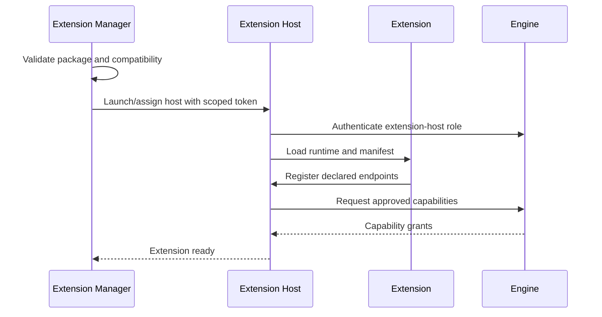

# 701 — Extension Architecture

**Status:** Proposed  
**Audience:** SDK, runtime, process, security contributors  
**Canonical:** Yes  
**Required context:** `700-sdk-overview.md`, `01-runtime/101-process-model.md`  
**Related ADRs:** ADR-0047, ADR-0050

---

## 1. Purpose

This document defines process topology, extension-manager responsibilities, runtime ownership, communication, and restart behavior.

---

## 2. Process Topology

Third-party extensions execute in one or more extension-host processes.

Possible isolation modes:

- shared restricted host for low-risk extensions;
- dedicated host for high-risk or unstable extension;
- separate worker for media parsing or device integration;
- future WebAssembly sandbox inside host.

The engine never loads third-party native code directly.

---

## 3. Extension Manager

The extension manager owns:

- package discovery;
- signature and integrity validation;
- compatibility resolution;
- enable/disable state;
- permission grants;
- host assignment;
- lifecycle orchestration;
- schema migration coordination;
- update/uninstall;
- diagnostics;
- crash-loop response.

---

## 4. Extension Host

The host owns:

- loading extension runtime;
- SDK protocol endpoint;
- extension task scheduling;
- quotas;
- extension-local storage access;
- mediated network/file requests;
- log forwarding;
- UI contribution registration;
- data-plane bridges;
- crash containment.

The host is not authoritative for project state.

---

## 5. Runtime Instance

One extension package may have:

- global instance;
- per-project instance;
- per-source instance;
- per-output instance;
- per-operation instance.

The manifest and extension kind define valid scopes.

Each instance has stable runtime ID and generation.

---

## 6. Host Assignment

Assignment considers:

- trust tier;
- native-code requirement;
- media access;
- resource profile;
- crash history;
- project policy;
- developer mode;
- platform constraints.

Moving an extension to a new host creates new runtime generations.

---

## 7. Startup Flow

---

## 8. Shutdown

Shutdown sequence:

1. stop new calls;
2. cancel operations;
3. detach UI contributions;
4. stop source/output instances;
5. flush bounded extension state;
6. revoke capabilities;
7. close data-plane leases;
8. unload runtime or terminate host;
9. publish stopped state.

Timeouts escalate to host termination.

---

## 9. Host Crash

On host crash:

- invalidate all host-owned generations;
- mark affected extensions unavailable;
- stop or placeholder dependent sources;
- stop affected outputs safely;
- preserve project configuration;
- restart according to bounded policy;
- isolate repeatedly crashing extension;
- retain crash diagnostics.

---

## 10. Shared Host Isolation

If multiple extensions share one host:

- namespaces are separate;
- task quotas are per extension;
- storage is separate;
- capability tokens are extension-scoped;
- one extension cannot address another;
- crash attribution is recorded;
- repeated fault may trigger dedicated-host assignment.

---

## 11. Invariants

1. Third-party code is outside engine.
2. Extension manager owns lifecycle.
3. Host tokens are ephemeral and scoped.
4. Runtime generations change after host restart.
5. Project state survives host failure.
6. Shared-host namespaces remain isolated.
7. Shutdown is bounded.
8. Repeated crash disables or isolates extension.
9. Capabilities are revoked before unload completes.
10. Host never becomes project authority.

---

## 12. Required Tests

- shared host;
- dedicated host;
- host authentication;
- extension startup timeout;
- host crash;
- repeated crash isolation;
- shutdown timeout;
- capability revocation;
- shared-host namespace isolation;
- source placeholder after crash;
- output stop after crash;
- project reopen with extension absent.

---

## 13. AI Implementation Notes

Do not let extension runtime call engine internals through shared-memory pointers.

Do not assume a shared host provides isolation automatically; enforce namespaces and quotas.

Do not delete project extension data after a host crash.
